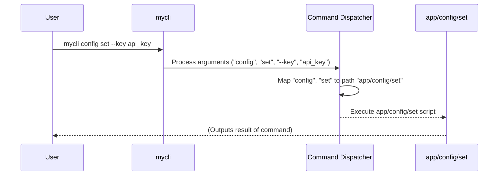

# Command Structure & Metadata


This chapter explains the core convention `bash-cli` uses for organizing your command-line interface (CLI) commands and their associated help information. Understanding this structure is fundamental to building and managing your CLI application effectively.

Imagine you are building a new CLI tool, maybe for managing cloud resources. You need commands like `resource create`, `resource list`, and `resource delete`. How do you organize the code for these commands? How do you ensure users can easily discover them and get help? `bash-cli` solves this by mapping your desired command structure directly to a directory structure on your filesystem.

## Key Concepts

The command structure relies on a few simple conventions within the `app/` directory of your `bash-cli` project:

1.  **Executable Scripts as Commands:** Every executable file within the `app/` directory hierarchy represents a command or subcommand. For example, `app/status` corresponds to the command `mycli status`, and `app/user/create` corresponds to `mycli user create`.
2.  **Directories as Command Groups:** Directories group related commands. The directory `app/user/` acts as a namespace for user-related commands like `create` and `delete`.
3.  **`.help` Files for Documentation:**
    *   A file named `<command_name>.help` placed next to a command script (`app/user/create.help` for `app/user/create`) contains the detailed help text for that specific command.
    *   A file named `.help` inside a directory (`app/user/.help`) contains help text describing the command group or category represented by that directory.
4.  **`.usage` Files for Argument Summaries:** A file named `<command_name>.usage` placed next to a command script (`app/user/create.usage`) provides a short, one-line summary of the command's arguments, often shown in help listings.

## Using the Structure

This file-based system makes managing your commands intuitive. You primarily interact with this structure using the built-in `create` and `rm` commands provided by `bash-cli`.

### Creating Commands

To add a new command, you use the `bash-cli create` command followed by the desired command path.

**Use Case:** Let's add a command `config set` to our CLI.

**Input:**

```bash
bash-cli create config set
```

**Result:**

`bash-cli` will create the necessary directory and files within the `app/` directory:

```
app/
├── config/
│   ├── .help         # Help file for the 'config' category
│   └── set           # Executable script for 'config set' command
│   ├── set.help      # Detailed help for 'config set'
│   └── set.usage     # Argument summary for 'config set'
└── ... (other commands/directories) ...
```

It generates placeholder content in these files:

*   `app/config/set`: A basic executable Bash script.
*   `app/config/set.help`: Placeholder help text.
*   `app/config/set.usage`: Placeholder usage string.
*   `app/config/.help`: Placeholder category help (if the `config` directory was newly created).

You then edit these files to implement your command logic and provide meaningful documentation.

### Removing Commands

To remove a command or an entire command group, use the `bash-cli rm` command.

**Use Case:** Let's remove the `config set` command we just created.

**Input:**

```bash
bash-cli rm config set
```

**Result:**

`bash-cli` will remove the script and its associated metadata files:

*   Removes `app/config/set`
*   Removes `app/config/set.help`
*   Removes `app/config/set.usage`

If removing the last command within a directory (e.g., `bash-cli rm config`), it can also remove the directory itself and its `.help` file.

## Internal Implementation

How does `bash-cli` use this structure? When a user runs your CLI (e.g., `mycli config set --key api_key --value 123`), the core [Command Dispatcher](02_command_dispatcher_.md) logic translates the input arguments (`config`, `set`) into a filesystem path (`app/config/set`).



The [Help Generation](03_help_generation_.md) system similarly uses this structure. When help is requested (e.g., `mycli config set --help` or `mycli config help`), it looks for the corresponding `.help` and `.usage` files based on the requested command path.

The `create` and `rm` commands directly manipulate this file structure.

**`create` Snippet (`app/command/create.sh`):**

This part creates the command script file and makes it executable.

```bash
# ... (determine CMD_DIR and CMD_NAME) ...

# Create the executable script file
cat > "$CMD_DIR/$CMD_NAME" <<EOT
#!/usr/bin/env bash
echo -e "\033[36mTODO\033[39m: Implement this command"
EOT
chmod +x "$CMD_DIR/$CMD_NAME"
```

This part creates the placeholder `.usage` and `.help` files.

```bash
# ... (determine CMD_DIR and CMD_NAME) ...

# Create the usage file
echo "ARGS..." > "$CMD_DIR/$CMD_NAME.usage"

# Create the help file
cat > "$CMD_DIR/$CMD_NAME.help" <<EOT
ARGS  - The arguments you wish to provide to this command

TODO: Fill out the help information for this command.
EOT
```

**`rm` Snippet (`app/command/rm.sh`):**

This part removes the command script and its metadata if they exist.

```bash
# ... (determine CMD_DIR and CMD_NAME) ...

if [[ -f "${CMD_DIR:?}/$CMD_NAME" ]]; then
    rm -f "${CMD_DIR:?}/$CMD_NAME"
    rm -f "${CMD_DIR:?}/$CMD_NAME.help"
    rm -f "${CMD_DIR:?}/$CMD_NAME.usage"
elif [[ -d "${CMD_DIR:?}/$CMD_NAME" ]]; then
    # Logic to remove directory if it's a category
    rm -Rf "${CMD_DIR:?}/$CMD_NAME"
fi
```

These commands ensure that the file structure always reflects the available commands and their associated documentation according to the convention.

## Conclusion

The file and directory structure within `app/`, along with the `.help` and `.usage` metadata files, forms the backbone of command organization in `bash-cli`. This convention makes commands discoverable, simplifies management through tools like `create` and `rm`, and enables automated features like help generation and command dispatching.

Next, we will explore how user input is translated into the execution of these command scripts in the [Command Dispatcher](02_command_dispatcher_.md) chapter.

---

Generated by [AI Codebase Knowledge Builder](https://github.com/The-Pocket/Doc-Codebase-Knowledge)