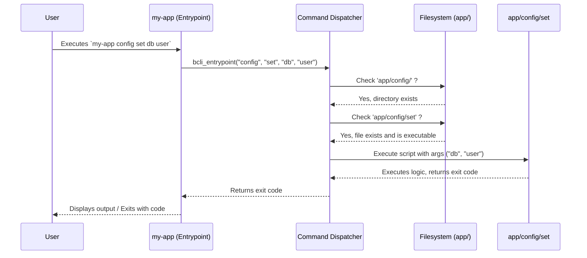

# Command Structure & Metadata


This chapter explains how `bash-cli` organizes commands and their associated help information using a simple file and directory structure. Understanding this convention is key to building and managing your CLI application.

Imagine you are building a command-line tool called `my-app`. You want to add a command to manage configuration, specifically `my-app config set <key> <value>`. How do you tell `bash-cli` where the code for this command lives and how to display help for it? `bash-cli` solves this by mapping command arguments directly to files and directories within your project's `app/` folder.

## Key concepts

The core idea is **convention over configuration**. Instead of complex registration code, `bash-cli` relies on a predefined structure:

1.  **Command Scripts:** Each executable command or subcommand corresponds to an executable script file within the `app/` directory hierarchy. For `my-app config set`, the script would be located at `app/config/set`. The script file can have any name, but typically it matches the command name (e.g., `set`). It doesn't require a `.sh` extension.
2.  **Directory Hierarchy:** Subcommands are represented by nested directories. The command `my-app config set` maps to the file `set` inside the `app/config/` directory.
3.  **Metadata Files:**
    *   **`.help` Files:** Contain detailed help text.
        *   For a command script like `app/config/set`, the corresponding help file is `app/config/set.help`.
        *   For a command category (a directory like `app/config/`), the help file is `app/config/.help`. This provides context when a user runs `my-app config help` or just `my-app config`.
    *   **`.usage` Files:** Contain a short, one-line summary of the command's arguments, displayed in help listings. For `app/config/set`, the usage file is `app/config/set.usage`.

## Using the structure

Let's revisit the use case: adding `my-app config set <key> <value>`.

Using the `bash-cli` conventions, you would create the following file structure within your project:

```
my-app-project/
└── app/
    ├── config/              # Directory for 'config' subcommand
    │   ├── .help            # Help text for the 'config' category
    │   ├── set              # Executable script for 'set' subcommand
    │   ├── set.help         # Detailed help for 'set'
    │   └── set.usage        # Usage line for 'set'
    └── .bash_cli            # Marker file for the project root
    # Other top-level commands or directories...
```

You don't need to create these manually. `bash-cli` provides built-in commands to manage this structure.

**Creating a Command:**

Use the `bash-cli command create` command (which is part of the core `bash-cli` framework itself). To create our example command:

```bash
bash-cli command create config set
```

This command will:

1.  Create the `app/config/` directory if it doesn't exist.
2.  Create a placeholder `app/config/.help` file if it doesn't exist.
3.  Create the executable script `app/config/set`.
4.  Create the help file `app/config/set.help`.
5.  Create the usage file `app/config/set.usage`.

**Example `app/config/set` (Generated):**

```bash
#!/usr/bin/env bash
# Script for 'my-app config set'
echo -e "\033[36mTODO\033[39m: Implement this command"
# Add logic here to handle <key> and <value> arguments ($1, $2, etc.)
```

**Example `app/config/set.usage` (Generated):**

```
<key> <value>
```

**Example `app/config/set.help` (Generated):**

```
ARGS  - The arguments you wish to provide to this command

Sets a configuration key to a specific value.
TODO: Fill out the help information for this command.
```

**Removing a Command:**

Similarly, you can remove a command and its associated metadata files using `bash-cli command rm`:

```bash
bash-cli command rm config set
```

This command will remove `app/config/set`, `app/config/set.help`, and `app/config/set.usage`. If the `app/config` directory becomes empty (except possibly for `.help`), you might remove it manually or use standard shell commands like `rmdir`.

## Internal implementation

Under the hood, several core components interact with this file structure.

1.  **[Command Dispatcher](02_command_dispatcher_.md):** When you run your CLI (e.g., `my-app config set key value`), the dispatcher translates the arguments (`config`, `set`) into a file path (`app/config/set`). It traverses the `app/` directory, matching arguments to subdirectories or files. Once it finds the executable script, it runs it, passing any remaining arguments (`key`, `value`).
2.  **[Help Generation](03_help_generation_.md):** When help is requested (e.g., `my-app config set --help` or `my-app config help`), the help system looks for the corresponding `.help` and `.usage` files based on the command path derived by the dispatcher. It reads these files to construct the help output.
3.  **[Bash Completion Logic](04_bash_completion_logic_.md):** The completion system inspects the `app/` directory structure to suggest available commands and subcommands when the user presses the `Tab` key.

**Execution Flow Example (`my-app config set db user`)**



**Code Insights:**

The `create` command automates the file/directory setup. Here's a simplified view of its logic:

```bash
# Simplified from app/command/create.sh
# Assume arguments are "config" "set"

APP_DIR="app" # Determined project app directory
CMD_DIR="$APP_DIR"
SUBDIRS=("config") # All args except last
CMD_NAME="set"     # Last argument

# Create directories if they don't exist
for dir in "${SUBDIRS[@]}"; do
    CMD_DIR="$CMD_DIR/$dir"
    if [[ ! -d "$CMD_DIR" ]]; then
        mkdir "$CMD_DIR"
        # Create placeholder category help
        echo "Help for $dir category" > "$CMD_DIR/.help"
    fi
done

# Create the command script file
cat > "$CMD_DIR/$CMD_NAME" <<EOT
#!/usr/bin/env bash
# TODO: Implement command
EOT
chmod +x "$CMD_DIR/$CMD_NAME"

# Create the .usage file
echo "<key> <value>" > "$CMD_DIR/$CMD_NAME.usage"

# Create the .help file
echo "Detailed help for $CMD_NAME." > "$CMD_DIR/$CMD_NAME.help"
```

The dispatcher logic within `bash-cli.inc.sh` traverses this structure:

```bash
# Simplified from bcli_entrypoint in bash-cli.inc.sh
# Assume arguments $@ are ("config", "set", "db", "user")

cmd_file="$root_dir/app/" # Starts at app/
cmd_arg_start=1

# Loop through arguments, descending into directories
while [[ -d "$cmd_file" && $cmd_arg_start -le $# ]]; do
    # Check if arg is 'help' -> handle help display (see Help Generation)
    # ...

    # Append argument to path if it's a directory component
    cmd_file="$cmd_file/${!cmd_arg_start}" # e.g., app/config, then app/config/set
    cmd_arg_start=$((cmd_arg_start+1))
done

# cmd_file is now "app/config/set"
# cmd_args are ("db", "user")

if [[ -f "$cmd_file" ]]; then
    # Execute the command script
    "$cmd_file" "${cmd_args[@]}"
elif [[ -d "$cmd_file" ]]; then
    # Ran out of args at a directory, show help for that dir
    "$root_dir/help" "$0" "$@"
else
    # Command not found
    # ... show error and help ...
fi
```

## Conclusion

The file-based command structure is a core convention in `bash-cli`. It provides a simple, transparent way to organize your CLI's commands, subcommands, and their associated documentation (`.help` and `.usage` files). This structure is directly utilized by the [Command Dispatcher](02_command_dispatcher_.md), [Help Generation](03_help_generation_.md), and [Bash Completion Logic](04_bash_completion_logic_.md). The built-in `create` and `rm` commands help manage this structure efficiently.

[Next Chapter: Command Dispatcher](02_command_dispatcher_.md)

---

Generated by [AI Codebase Knowledge Builder](https://github.com/The-Pocket/Doc-Codebase-Knowledge)