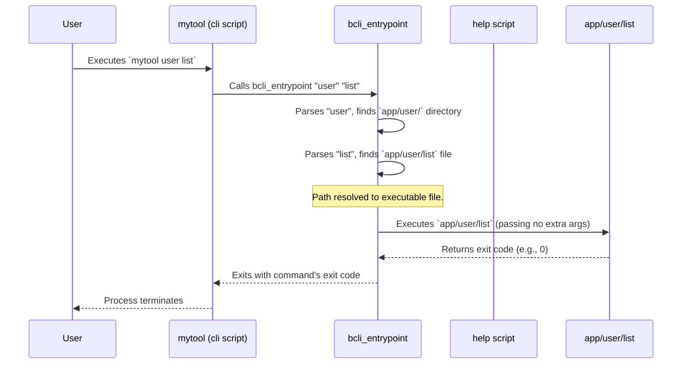
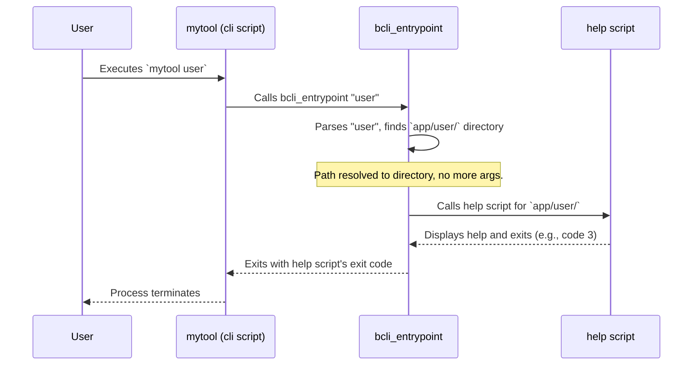

# Command Dispatcher


This chapter explains the Command Dispatcher, the core mechanism within `bash-cli` that interprets your command-line input and routes it to the correct script for execution.

Imagine you have created a CLI tool named `mytool` using `bash-cli`. You want to run a command like `mytool user create alice`. How does `mytool` know that `user create` corresponds to a specific script that handles user creation? The Command Dispatcher is responsible for this logic. It parses the arguments (`user`, `create`) and navigates the project's `app/` directory to find and execute the appropriate script (`app/user/create`), passing any further arguments (like `alice`) to it.

## How it works

The dispatcher's primary role is to translate the sequence of arguments provided on the command line into a path within the `app/` directory.

1.  **Argument Parsing:** It takes the arguments provided after the main script name (e.g., `user`, `create` in `mytool user create`).
2.  **Directory Navigation:** It sequentially uses these arguments to traverse the `app/` directory. For `mytool user create`, it first looks for `app/user/`. If that directory exists, it then looks for `app/user/create`.
3.  **Execution or Help:**
    *   **Command Found:** If the path resolves to an executable file (like `app/user/create`), the dispatcher executes that file, passing any remaining arguments (`alice`) to it.
    *   **Directory Specified:** If the arguments lead to a directory (e.g., running `mytool user` without a subsequent command) and not a specific command file, the dispatcher usually invokes the [Help Generation](03_help_generation_.md) system to display available subcommands within that directory.
    *   **Command Not Found:** If at any point the path does not correspond to an existing file or directory (e.g., `mytool user delete` when `app/user/delete` doesn't exist), the dispatcher again delegates to the [Help Generation](03_help_generation_.md) system, often displaying an error message indicating the command was not found.

This entire process is primarily handled by the `bcli_entrypoint` function located within the core `bash-cli.inc.sh` library file, which is invoked by your main CLI script.

## Implementation overview

The heart of the dispatcher is the `bcli_entrypoint` function. When you run your CLI tool, the main script sources `bash-cli.inc.sh` and then calls `bcli_entrypoint`, passing all command-line arguments to it.

Here is a simplified view of the dispatcher's flow when a user runs `mytool user list`:



If the user ran `mytool user` (ending on a directory):



## Code deep dive

Let's look at a simplified version of the `bcli_entrypoint` function from `bash-cli.inc.sh` to see how it achieves this navigation and execution.

**1. Initial Setup & Argument Loop:**

```bash
function bcli_entrypoint() {
    local root_dir;
    root_dir=$(dirname "$(bcli_resolve_path "$0")") # Find script's directory

    # Start building the potential command path from 'app/'
    local cmd_file;
    cmd_file="$root_dir/app/"
    local cmd_arg_start;
    cmd_arg_start=1 # Index of the first argument to check

    # Loop through arguments as long as we are matching directories
    while [[ -d "$cmd_file" && $cmd_arg_start -le $# ]]; do
        # Special handling for 'help' argument... (simplified here)

        # Append the current argument to the path
        cmd_file="$cmd_file/${!cmd_arg_start}"
        # Move to the next argument index
        cmd_arg_start=$((cmd_arg_start+1))
    done
    # ... rest of the function
}
```

This part initializes the search path starting at `app/` and iterates through the command-line arguments (`$1`, `$2`, etc., accessed via `${!cmd_arg_start}`). With each argument, it appends it to `cmd_file` and checks if the result is still a directory (`-d`). The loop continues as long as arguments match existing directories.

**2. Handling Final Path:**

After the loop, `cmd_file` holds the path constructed from the arguments, and `cmd_arg_start` indicates the index of the first argument *not* used in the path construction (these are the arguments for the command itself).

```bash
    # ... loop ends ...

    # Store remaining arguments for the command
    local cmd_args;
    cmd_args=("${@:cmd_arg_start}")

    # Case 1: Path is a directory (command incomplete)
    if [ -d "$cmd_file" ]; then
        # Delegate to the help system for the directory
        "$root_dir/help" "$0" "$@" # Pass original script name and all args
        exit 3 # Exit code indicating help was shown
    fi

    # Case 2: Path does not exist (command not found)
    if [[ ! -f "$cmd_file" ]]; then
        # Delegate to help for the parent directory
        "$root_dir/help" "$0" "${@:1:$((cmd_arg_start-1))}"
        # Show an error message
        >&2 echo "Error: Command not found: ${*:1:$cmd_arg_start}"
        exit 3
    fi

    # Case 3: Path is a file (command found)
    # Handle --help argument... (simplified here)

    # Execute the command script, passing remaining arguments
    "$cmd_file" "${cmd_args[@]}"
    local EXIT_CODE=$? # Capture the command's exit code

    # Optional: Show help if command exits with code 3
    if [[ $EXIT_CODE == 3 ]]; then
        "$root_dir/help" "$0" "$@"
    fi

    # Exit with the command's original exit code
    exit $EXIT_CODE
}
```

This section checks the final state of `cmd_file`:
*   If it is still a directory (`-d`), it means the user likely stopped short of specifying a full command (e.g., `mytool user`). It calls the main `help` script.
*   If it is not a file (`! -f`), the command doesn't exist. It calls `help` for the deepest valid directory found and prints an error.
*   If it *is* a file (`-f`), the command is found. It executes `$cmd_file`, passing the remaining arguments (`"${cmd_args[@]}"`). It then captures and respects the exit code of the executed command script. There is also logic (simplified above) to handle the `--help` option specifically for the command.

This dispatcher logic ensures that command execution is seamlessly mapped to the filesystem structure within the `app/` directory, providing a clear and extensible way to organize CLI commands, while gracefully handling incomplete or non-existent commands by leveraging the [Help Generation](03_help_generation_.md) system.

## Conclusion

The Command Dispatcher is the central router for your `bash-cli` application. By mapping command-line arguments to the `app/` directory structure, it determines which script to execute or when to provide assistance via the help system. Understanding the dispatcher is key to organizing your commands effectively and diagnosing routing issues. Its implementation within the `bcli_entrypoint` function provides a robust foundation for your CLI tool.

Next, learn how the help messages themselves are generated based on your command structure and metadata files.

[Next Chapter: Help Generation](03_help_generation_.md)

---

Generated by [AI Codebase Knowledge Builder](https://github.com/The-Pocket/Doc-Codebase-Knowledge)