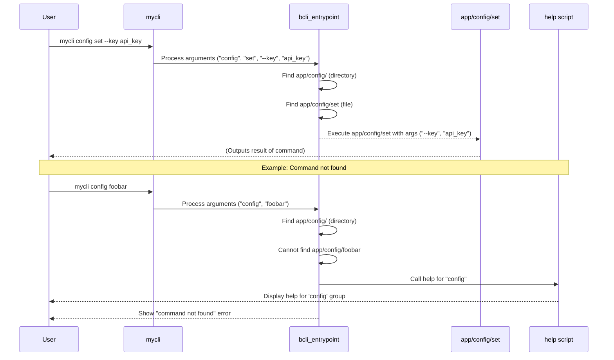

# Command Dispatcher


This chapter describes the mechanism `bash-cli` uses to interpret your command-line input and execute the correct command script.

In the previous chapter, [Command Structure & Metadata](01_command_structure___metadata_.md), we saw how commands are organized using a directory structure within the `app/` folder. Now, how does the CLI actually *use* that structure when you type a command like `mycli user list`? The Command Dispatcher is the core logic responsible for this translation, acting as the central router for your CLI application.

## What the dispatcher does

The primary job of the Command Dispatcher is to:

1.  **Parse** the arguments provided by the user on the command line.
2.  **Navigate** the `app/` directory structure based on these arguments.
3.  **Identify** the specific command script or command group the user intends to run.
4.  **Execute** the target command script, passing along any remaining arguments.
5.  **Delegate** to the help system if a command isn't fully specified or cannot be found.

This entire process is primarily handled by the `bcli_entrypoint` function within the `bash-cli.inc.sh` core library file.

## How it works: From input to execution

Let's trace the journey of a typical command:

**Use Case:** A user wants to run the `set` command within the `config` group, providing specific options.

**Input:**

```bash
mycli config set --key api_key --value 12345
```

**Dispatcher Process:**

1.  The main `cli` script captures all arguments (`config`, `set`, `--key`, `api_key`, `--value`, `12345`) and passes them to the `bcli_entrypoint` function.
2.  `bcli_entrypoint` starts at the `app/` directory.
3.  It looks at the first argument, `config`. It finds a directory named `config` inside `app/`. It consumes this argument and moves its focus *into* `app/config/`.
4.  It looks at the next argument, `set`. It finds an executable file named `set` inside `app/config/`. It consumes this argument. Since it found a file, it stops searching for command parts.
5.  The dispatcher identifies `app/config/set` as the target command script.
6.  The *remaining* arguments (`--key`, `api_key`, `--value`, `12345`) are collected.
7.  The dispatcher executes the script `app/config/set`, passing the remaining arguments to it: `app/config/set --key api_key --value 12345`.

## Handling incomplete or invalid commands

The dispatcher also gracefully handles situations where the input doesn't map directly to an executable command script:

*   **Directory Specified:** If the user types `mycli config` (and `app/config` is a directory), the dispatcher stops after matching `config`. Since the final path `app/config/` is a directory, it means the user hasn't specified a final command. In this case, the dispatcher delegates the request to the [Help Generation](03_help_generation_.md) system to display help for the `config` command group.
*   **Command Not Found:** If the user types `mycli config non-existent-command`, the dispatcher finds `app/config/` but cannot find `non-existent-command` inside it. It will then delegate to the [Help Generation](03_help_generation_.md) system (showing help for `config`) and also print an error message indicating that the specific command was not found.
*   **`--help` Argument:** If `--help` is encountered *after* a valid command path has been identified (e.g., `mycli config set --help`), the dispatcher recognizes this special argument and delegates to the [Help Generation](03_help_generation_.md) system to show help for the `config set` command.

## Internal implementation

The core logic resides within the `bcli_entrypoint` function in `bash-cli.inc.sh`.



### Code Snippets from `bcli_entrypoint`

**1. Traversing Arguments:**

This loop iterates through the command-line arguments, attempting to match them to directories or files within `app/`.

```bash
# --- From: bash-cli.inc.sh (within bcli_entrypoint) ---

# Start searching in the application's root command directory
local cmd_file="$root_dir/app/"
local cmd_arg_start=1 # Index of the first argument to check

# Keep going as long as we find directories matching arguments
while [[ -d "$cmd_file" && $cmd_arg_start -le $# ]]; do

    # Special check for 'help' subcommand
    if [[ "${!cmd_arg_start}" == "help" ]]; then
        # ... (logic to call help script and exit) ...
        exit 3
    fi

    # Append the current argument to the path
    cmd_file="$cmd_file/${!cmd_arg_start}"
    # Move to the next argument
    cmd_arg_start=$((cmd_arg_start+1))
done
```

This block builds the `cmd_file` path (e.g., `app/config/set`) by consuming arguments one by one as long as they correspond to directories. `cmd_arg_start` keeps track of the first argument *not* used in the path, which will become the start of the arguments passed to the command script.

**2. Handling Directory Path:**

If the loop finishes and `cmd_file` points to a directory, it means the user didn't provide a complete command.

```bash
# --- From: bash-cli.inc.sh (within bcli_entrypoint) ---

# Collect remaining arguments for the potential command script
local cmd_args=("${@:cmd_arg_start}")

# If the final path is a directory, show help for that directory
if [ -d "$cmd_file" ]; then
    "$root_dir/help" "$0" "$@" # Call help with original arguments
    exit 3
fi
```

This checks if the resolved path is a directory. If so, it calls the main `help` script (part of the [Help Generation](03_help_generation_.md) system) to display relevant commands in that group.

**3. Handling Non-Existent Command:**

If the final path does *not* point to an existing file, the command is invalid.

```bash
# --- From: bash-cli.inc.sh (within bcli_entrypoint) ---

# If the file doesn't exist, show help for the parent directory and error out
if [[ ! -f "$cmd_file" ]]; then
    # Call help for the directory *containing* the expected command
    "$root_dir/help" "$0" "${@:1:$((cmd_arg_start-1))}"
    # Print error message
    >&2 echo -e "${COLOR_RED}We could not find the command [...]${COLOR_NORMAL}"
    exit 3
fi
```

This checks if the resolved path corresponds to an actual file. If not, it calls help for the *parent* path (e.g., for `mycli config non-existent`, it shows help for `config`) and prints an error message.

**4. Executing the Command:**

If a valid command script file is found, it's executed with the remaining arguments.

```bash
# --- From: bash-cli.inc.sh (within bcli_entrypoint) ---

# Check if --help was passed among the remaining arguments
# ... (loop checks cmd_args for --help and calls help script if found) ...

# Run the command script with the remaining arguments
"$cmd_file" "${cmd_args[@]}"
EXIT_CODE=$?

# Optional: If command script exits with code 3, show its help
if [[ $EXIT_CODE == 3 ]]; then
    "$root_dir/help" "$0" "$@"
fi

# Exit with the same code as the command script
exit $EXIT_CODE
```

This section first checks if `--help` was provided as an argument *to the command script*. If not, it executes the found `cmd_file`, passing the collected `cmd_args`. It also captures the exit code and potentially shows help if the script signals it by exiting with code 3.

## Conclusion

The Command Dispatcher (`bcli_entrypoint`) is the engine that connects user input to the correct script within your `app/` directory, guided by the conventions established in the [Command Structure & Metadata](01_command_structure___metadata_.md) chapter. It intelligently handles path resolution, argument passing, and delegation to the help system for various scenarios.

Next, we will delve into how the help messages themselves are generated in the [Help Generation](03_help_generation_.md) chapter.

---

Generated by [AI Codebase Knowledge Builder](https://github.com/The-Pocket/Doc-Codebase-Knowledge)