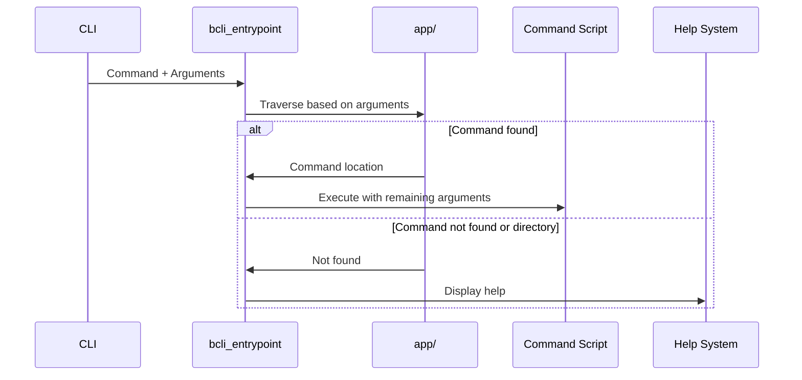

# Command Dispatcher

This chapter explains how the command dispatcher routes commands in `bash-cli`. Imagine you have various sub-commands and want to invoke them based on user input. The dispatcher acts like a traffic controller, directing execution to the right script.

## Concept: Routing User Input to Commands

This section describes the core functionality of the command dispatcher: directing execution based on command-line arguments.

The command dispatcher analyzes the arguments passed to the CLI. It uses these arguments to navigate a directory structure, usually `app/`, where command scripts reside. If a matching script is found, it's executed.  If a directory is encountered but no final command, or if no matching script exists, the dispatcher typically shows help information.

## Procedure: Dispatching a Command

This section details how commands are dispatched.

### Prerequisites

A basic `bash-cli` project structure, as described in [Command Structure & Metadata](01_command_structure___metadata_.md).

### Procedure

1.  The CLI entry point receives user input as command-line arguments.

2.  The dispatcher starts at the `app/` directory.

3.  It iterates through the arguments, treating each as a subdirectory or script name within `app/`.

4.  If a matching directory is found, the dispatcher moves into it.

5.  If the final argument points to an executable file, it’s executed as the command. Remaining arguments are passed to the command script.

6.  If a directory is reached without a final command, or a matching script isn't found, the dispatcher redirects to the help system. See [Help Generation](03_help_generation_.md) for details.


### Verification

Run the CLI with different combinations of valid and invalid commands. Observe the output and exit codes.  Valid commands should execute successfully. Invalid or incomplete commands should display help information and exit with code 3.

### Troubleshooting

If commands aren’t dispatched correctly, check:

*   Correctness of `app/` directory structure and file permissions.
*   Logic within `bcli_entrypoint` for handling arguments and errors.

### Next Steps

Learn how help information is generated and displayed in [Help Generation](03_help_generation_.md).

## Internal Implementation: `bcli_entrypoint`

This section describes how the `bcli_entrypoint` function implements command dispatching.



The `bcli_entrypoint` function in `bash-cli.inc.sh` handles command dispatching.

```bash
# ... (other functions)

function bcli_entrypoint() {
    # ... (setup)

    # Construct command path
    local cmd_file="$root_dir/app/"
    # ... (iterate through arguments and append to cmd_file)

    # ... (handle "help" argument)

    # ... (handle directory case - delegate to help)

    # ... (handle command not found - delegate to help)

    # ... (handle --help argument within command)

    # Execute command
    "$cmd_file" "${cmd_args[@]}"
    # ... (handle exit code)
}

# ... (other functions)
```

The code iteratively builds the command path using arguments. It handles special cases like "help" and missing commands by delegating to the help system. Finally, it executes the located command script.


## Conclusion

The command dispatcher is the core of `bash-cli`, routing commands based on user input. Understanding its function is key to developing and using `bash-cli` effectively. Next, learn about [Help Generation](03_help_generation_.md).


---

Generated by [AI Codebase Knowledge Builder](https://github.com/The-Pocket/Doc-Codebase-Knowledge)