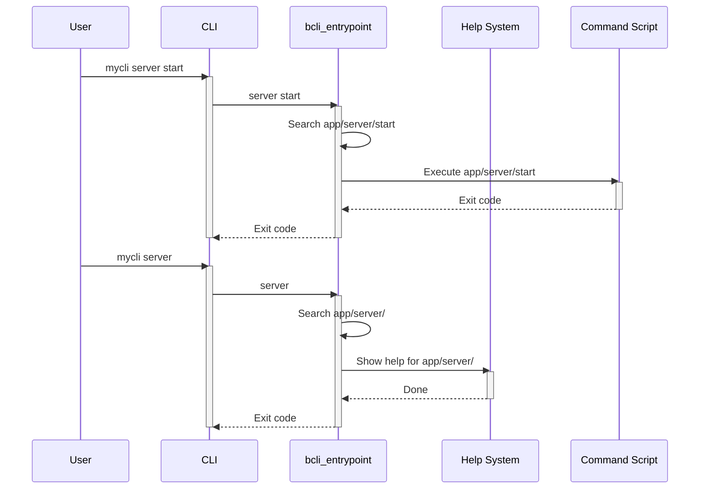

# Command Dispatcher

This chapter explains how the command dispatcher determines which command to run based on the arguments you provide to your CLI.  Imagine you have a CLI with several subcommands organized like `mycli server start`, `mycli database migrate`, etc. The dispatcher figures out how to execute the right script for `server start` versus `database migrate`.

## Concept: Routing Commands

The command dispatcher acts like a traffic controller, directing commands to the correct scripts.  It does this by examining the directory structure inside the `app/` directory.  This structure mirrors the command hierarchy. For example, the command `mycli server start` would map to a file located at `app/server/start`. If a directory is found but no final command (e.g., `mycli server`), the dispatcher typically shows the help information for that directory. This is primarily handled by the `bcli_entrypoint` function.




## Reference: `bcli_entrypoint` Implementation

The core logic resides within the `bcli_entrypoint` function (in `bash-cli.inc.sh`).  It breaks down as follows:

1. **Resolve Paths:**  Determines the absolute path of the CLI script using `bcli_resolve_path`.

    ```bash
    root_dir=$(dirname "$(bcli_resolve_path "$0")")
    ```
    This line obtains the absolute path to the directory containing the main CLI script.


2. **Command Location:**  Iterates through the provided command arguments, building a path within the `app/` directory.

    ```bash
    cmd_file="$root_dir/app/"
    # ... loop through arguments to build command path ...
    cmd_file="$cmd_file/${!cmd_arg_start}"
    ```
    These lines construct the path to the command script within the `app/` directory based on the provided arguments.

3. **Help Handling:**  If the built path is a directory, or if the `--help` flag is present, the [Help Generation](03_help_generation_.md) system is invoked. Also delegates to the help system if a command file is not found.

    ```bash
    if [ -d "$cmd_file" ]; then
        "$root_dir/help" "$0" "$@"
        exit 3
    ```
    This code snippet shows how the help system is invoked if a directory is found. Similar logic handles `--help` and missing commands.

4. **Command Execution:**  If a valid command file is found, it's executed.

    ```bash
    "$cmd_file" "${cmd_args[@]}"
    EXIT_CODE=$?
    ```
    This executes the target command script with the remaining arguments. The exit code is captured for subsequent processing.


## Procedure: Using the dispatcher

### Prerequisites

Have a Bash CLI project utilizing the `bash-cli` framework.

### Steps

1. Define your command structure within the `app/` directory.  For example, to support `mycli server start`, create `app/server/start`.
2. Place the command logic within the corresponding files.
3. Call `bcli_entrypoint "$@"` in your main CLI script.

### Verification

Run your CLI with different arguments. Observe the output and exit codes to ensure the correct commands are executed.

### Troubleshooting

* **Command not found:** Verify the directory structure within `app/` matches your command structure.
* **Incorrect command executed:** Ensure the dispatcher logic correctly parses and routes the commands.

## Conclusion

The command dispatcher simplifies command handling by automatically mapping CLI arguments to command scripts. This makes your CLI more organized and easier to maintain. For more on generating help documentation, see [Help Generation](03_help_generation_.md).


---

Generated by [AI Codebase Knowledge Builder](https://github.com/The-Pocket/Doc-Codebase-Knowledge)