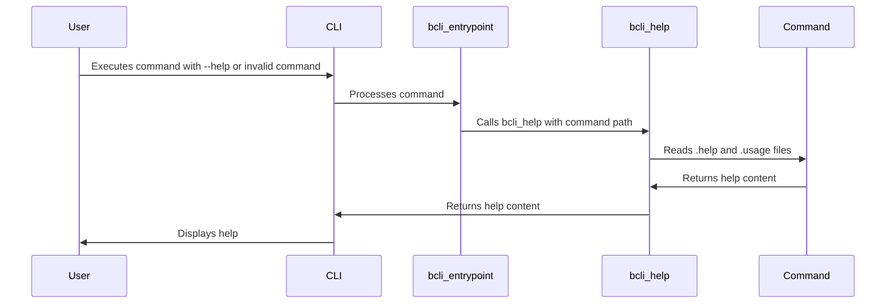

# Help Generation

This chapter explains how the `bash-cli` framework generates help documentation, allowing you to easily guide your users on how to use your CLI.  Imagine you're creating a new command and want users to understand its purpose and arguments.  The help generation system provides the structure and mechanisms to present this information clearly.

## Concept: Help System Overview

This section describes how the help system works within the `bash-cli` framework.

The `bash-cli` help system displays information about your CLI commands.  It's activated in three ways:

* **Explicitly:** Using the `help` command.
* **Implicitly:** When an incomplete or invalid command is entered.
* **Command-Specific:** When a command script exits with code 3 or receives the `--help` argument.

The system reads `.help` (detailed explanation) and `.usage` (quick usage summary) files located alongside your command scripts or within directories to build the help output. For directories, it also lists available subcommands.  The `bcli_help` function is the heart of this system.

## Procedure: Displaying Help

This section describes how to trigger help documentation.

### Prerequisites

A `bash-cli` project should be initialized ([CLI Installation & Uninstallation](05_cli_installation___uninstallation_.md)).

### Procedure Steps

1. **Explicit Help:** Run `bash-cli help <command_path>`.  For example, `bash-cli help create` displays help for the `create` command.

2. **Implicit Help:** Enter an incomplete or invalid command, like `bash-cli creat`.  The system will show help related to the closest matching command or directory.

3. **Command-Specific Help:**  Two ways to trigger help from within a command:
    * **Exit Code:** In your command script, `exit 3` to display its help.
    * **`--help` Argument:** Include logic in your command script to handle the `--help` argument and display its help.  Example:

    ```bash
    # --- File: app/command/my_command.sh ---
    if [[ "$1" == "--help" ]]; then
        # Display help specific to my_command
        cat my_command.help
        exit 0
    fi
    # ... rest of your command logic ...
    ```


### Verification

Run the commands mentioned above. Ensure the expected help information is displayed.

### Troubleshooting

If help is not displayed:
1. Verify `.help` and `.usage` files exist in the correct locations.
2. Check your command script's exit code and `--help` argument handling.

## Reference: Help File Structure

Help files are structured to provide both concise usage information and detailed explanations.

* **`.usage`:**  Contains a brief usage summary, often showing argument formats.  Example: `ARGS...`

* **`.help`:** Provides a detailed explanation of the command, its arguments, and its purpose.

## Concept: Internal Implementation

The `bcli_help` function in `bash-cli.inc.sh` handles help generation.



The `bcli_entrypoint` function calls `bcli_help` when needed, passing the path to the command or directory for which help is required.  `bcli_help` then locates and displays the appropriate `.help` and `.usage` files.

```bash
# --- File: bash-cli.inc.sh ---
function bcli_help() {
    # ... (simplified for brevity) ...
    if [[ -f "$help_file.help" ]]; then
        cat "$help_file.help"
        # ...
    fi
}
```


## Conclusion

This chapter covered the help generation system in `bash-cli`, enabling you to create user-friendly documentation for your CLI.  You learned how to trigger help, structure help files, and understand the underlying implementation.  Next, learn about [Bash Completion Logic](04_bash_completion_logic_.md).


---

Generated by [AI Codebase Knowledge Builder](https://github.com/The-Pocket/Doc-Codebase-Knowledge)