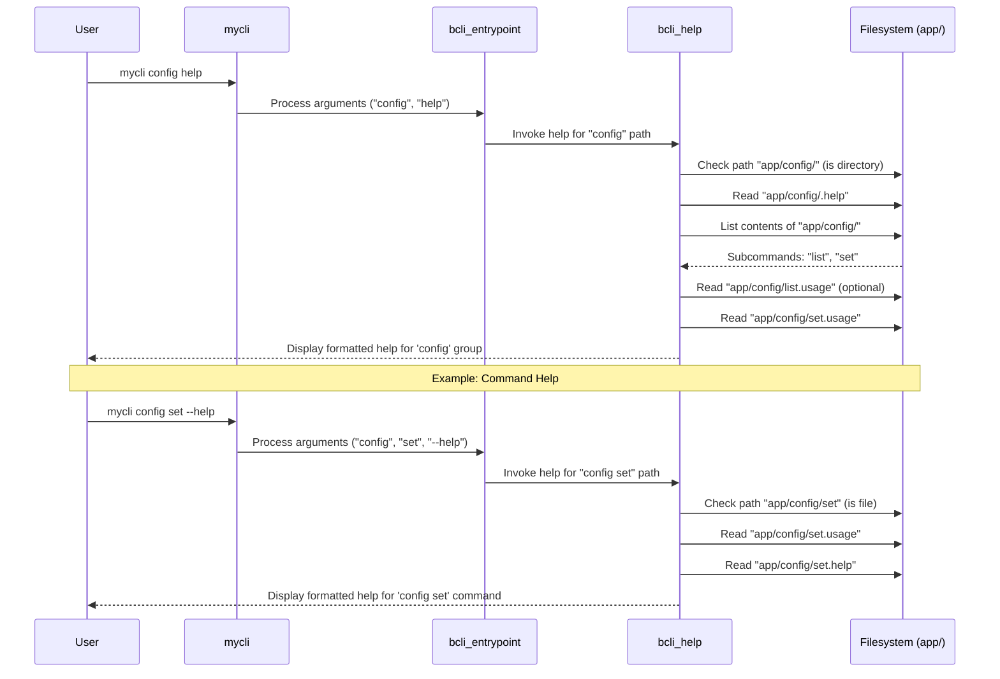

# Help Generation

In the previous chapter, [Command Dispatcher](02_command_dispatcher_.md), we learned how `bash-cli` routes user input to the correct command script. But what happens when a user needs guidance on how to use a command, or when the input doesn't quite match a valid command? This chapter explains the Help Generation system, which provides crucial information to users directly within the CLI.

This system displays helpful information about commands and command groups, ensuring users understand how to interact with your application effectively. It makes your CLI more discoverable and user-friendly.

## Key Concepts

The help system relies on specific conventions and mechanisms:

1.  **Metadata Files:** As introduced in [Command Structure & Metadata](01_command_structure___metadata_.md), the help system reads content from:
    *   `.help` files: Contain detailed descriptions. For a command like `app/config/set`, the `app/config/set.help` file is used. For a command group (directory) like `app/config/`, the `app/config/.help` file provides the group's description.
    *   `.usage` files: Provide a concise, single-line summary of a command's arguments (e.g., `app/config/set.usage`). This is often shown when listing available subcommands.
2.  **Triggering Help:** Help information can be displayed in several ways:
    *   **Explicitly:** The user runs the built-in `help` command (e.g., `mycli help config` or `mycli config help`).
    *   **Implicitly (Incomplete Command):** The user provides arguments that resolve to a directory, not a specific command file (e.g., `mycli config`). The dispatcher recognizes this isn't a complete command and shows help for the `config` group.
    *   **Implicitly (Invalid Command):** The user provides arguments that do not match any file or directory within the expected path (e.g., `mycli config foobar`). The dispatcher shows help for the parent group (`config`) and an error.
    *   **`--help` Argument:** The user adds `--help` after a valid command path (e.g., `mycli config set --help`). The dispatcher detects this flag and shows help for `config set`.
    *   **Exit Code 3:** A command script explicitly requests help to be shown by exiting with code `3`.
3.  **`bcli_help` Function:** The core logic for assembling and displaying help resides in the `bcli_help` function within the `bash-cli.inc.sh` library file. It interprets the command path requested and retrieves the relevant `.help` and `.usage` content.
4.  **Subcommand Listing:** When displaying help for a directory (command group), the system automatically lists the available subcommands and sub-groups found within that directory, using `.usage` files for summaries where available.

## Using Help

Let's see how the help system responds to different user inputs, assuming we have commands like `mycli config set` and `mycli config list`.

**Use Case 1:** Get help for the `config` command group.

**Input:**

```bash
mycli config help
# OR
mycli help config
# OR (implicitly)
mycli config
```

**Result (Conceptual):**

`bash-cli` will execute the `bcli_help` function for the `app/config/` path.

```
mycli config
TODO: Add help for this directory  # Content from app/config/.help

Commands

mycli config list                # Content from app/config/list.usage (if exists)
mycli config set ARGS...         # Content from app/config/set.usage
```

**Use Case 2:** Get help for the specific `config set` command.

**Input:**

```bash
mycli config set --help
# OR (if app/config/set exits with 3)
mycli config set <some_args>
```

**Result (Conceptual):**

`bash-cli` will execute `bcli_help` for the `app/config/set` path.

```
mycli config set ARGS...      # Content from app/config/set.usage
ARGS  - The arguments you wish to provide to this command # Content from app/config/set.help

TODO: Fill out the help information for this command.
```

## Internal Implementation

The [Command Dispatcher](02_command_dispatcher_.md) (`bcli_entrypoint`) determines *when* to show help, but the `bcli_help` function is responsible for *what* help to show.



### Code Snippets from `bcli_help`

**1. Locating the Help Target:**

Similar to the dispatcher, `bcli_help` traverses the `app/` directory based on the arguments provided (after the entrypoint script name).

```bash
# --- From: bash-cli.inc.sh (within bcli_help) ---

local help_file="$root_dir/app/"
local help_arg_start=2 # Start after script name and potential 'help' command

# Traverse directories based on arguments
while [[ -d "$help_file" && $help_arg_start -le $# ]]; do
    help_file="$help_file/${!help_arg_start}"
    help_arg_start=$((help_arg_start+1))
done
# Now, $help_file points to the target path (e.g., app/config/ or app/config/set)
```

This loop determines the specific file or directory for which help is requested.

**2. Displaying Directory Help:**

If the final `help_file` path points to a directory, it lists subcommands.

```bash
# --- From: bash-cli.inc.sh (within bcli_help) ---

if [[ -d "$help_file" ]]; then
    echo -e "${COLOR_GREEN}$cli_entrypoint ${COLOR_CYAN}${*:2:$((help_arg_start-1))} ${COLOR_NORMAL}"

    # Show the directory's own help text, if it exists
    if [[ -f "$help_file/.help" ]]; then
        cat "$help_file/.help"
        echo ""
    fi

    echo -e "${COLOR_MAGENTA}Commands${COLOR_NORMAL}"
    # Loop through items in the directory
    for file in "$help_file"/*; do
        cmd=$(basename "$file")
        # Skip hidden files/dirs and files with extensions (like .help/.usage)
        if [[ "$cmd" != .* && "$cmd" != *.* ]]; then
            echo -en "${COLOR_GREEN}$cli_entrypoint ${COLOR_CYAN}${*:2:$((help_arg_start-1))} $cmd ${COLOR_NORMAL}"
            # Try to show usage summary
            if [[ -f "$file.usage" ]]; then
                bcli_trim_whitespace "$(cat "$file.usage")"
                echo ""
            elif [[ -d "$file" ]]; then # Indicate sub-directory
                echo -e "${COLOR_MAGENTA}...${COLOR_NORMAL}"
            else
                echo "" # Just the command name if no usage
            fi
        fi
    done
    exit 0
fi
```

This block formats the output for a command group, including its own help text (from `.help`) and a list of its contained commands/sub-groups, using `.usage` files for summaries.

**3. Displaying Command Help:**

If the final `help_file` path points to a file (the command script itself), it displays the command's specific help.

```bash
# --- From: bash-cli.inc.sh (within bcli_help) ---

# Print command name and usage summary (if available)
echo -en "${COLOR_GREEN}$cli_entrypoint ${COLOR_CYAN}${*:2:$((help_arg_start-1))} ${COLOR_NORMAL}"
if [[ -f "$help_file.usage" ]]; then
    bcli_trim_whitespace "$(cat "$help_file.usage")"
    echo ""
else
    echo ""
fi

# Print detailed help content (if available)
if [[ -f "$help_file.help" ]]; then
    cat "$help_file.help"
    echo ""
fi
```

This block formats the output for a specific command, showing its usage line (from `<command>.usage`) followed by the detailed description (from `<command>.help`).

## Conclusion

The Help Generation system is essential for creating a user-friendly CLI. By leveraging `.help` and `.usage` files within the established [Command Structure & Metadata](01_command_structure___metadata_.md), and being triggered automatically by the [Command Dispatcher](02_command_dispatcher_.md) or explicitly by the user, it provides necessary guidance without requiring complex coding within each command script. The `bcli_help` function centralizes the logic for retrieving and formatting this information.

Next, we will explore how `bash-cli` assists users with completing commands as they type in the [Bash Completion Logic](04_bash_completion_logic_.md) chapter.

---

Generated by [AI Codebase Knowledge Builder](https://github.com/The-Pocket/Doc-Codebase-Knowledge)