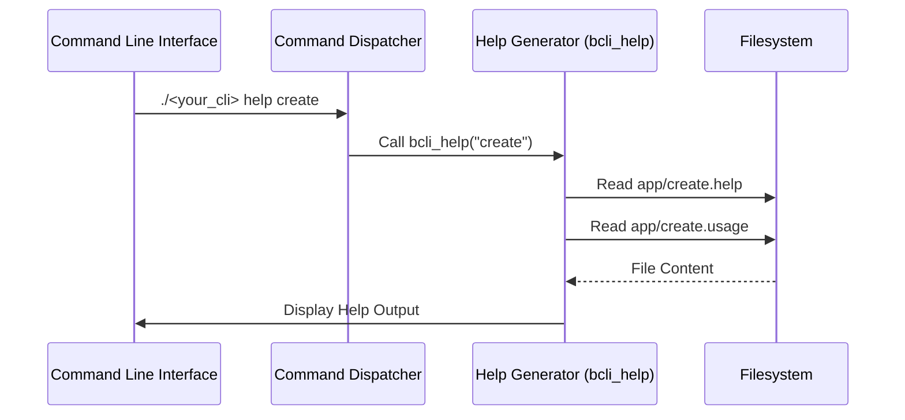

# Help Generation

This chapter explains how the `bash-cli` project generates help documentation, allowing you to understand how to use available commands and subcommands.  Imagine you are adding a new command to your CLI and want to ensure users can access clear instructions. This chapter will guide you through how `bash-cli` handles help generation.

## Key Concepts

Help generation in `bash-cli` is triggered in three primary ways:

* **Explicit Help Request:** Using the `help` command.
* **Implicit Help Request:**  Entering an incomplete or invalid command.
* **Command-Level Help Request:** Providing the `--help` argument to a specific command or a command script exiting with code 3.


The system relies on `.help` and `.usage` files within your project's command directories. The `.help` file provides detailed information about a command or directory, while the `.usage` file offers a concise usage summary. For directories, the help output also lists available subcommands.  The `bcli_help` function is the core component responsible for handling all help-related logic.

## Using Help Generation

Let us consider the scenario where you have a CLI with a `create` command:

```bash
./<your_cli> create <command_name>
```

If you want to get help about this command, you can use:

```bash
./<your_cli> help create
```

This will display the content of the `app/create.help` and `app/create.usage` files.

If you enter an invalid command such as:

```bash
./<your_cli> nonexistent_command
```

`bash-cli` will display help information related to the root of your CLI application, showing available top-level commands.


## Internal Implementation

The following sequence diagram illustrates a simplified help request flow:



The [Command Dispatcher](02_command_dispatcher_.md) receives the command and arguments.  If a help request is detected, it calls the `bcli_help` function.  `bcli_help` retrieves relevant information from the filesystem and displays it to the user.

### Code Deep Dive

The main logic resides in the `bcli_help` function within `bash-cli.inc.sh`.

```bash
# bash-cli.inc.sh

function bcli_help() {
    # ... (setup and locating help files) ...

    # Display help for a directory
    if [[ -d "$help_file" ]]; then
        # ... (display directory help and subcommands) ...
        exit 0
    fi

    # Display help for a command file
    echo -en  "${COLOR_GREEN}$cli_entrypoint ${COLOR_CYAN}${*:2:$((help_arg_start-1))} ${COLOR_NORMAL}"
    # ... (display .usage and .help content) ...
}
```

The code first locates the directory or command file specified by the user's input. If a directory is found, it lists available subcommands. If a command file is found, the corresponding `.usage` and `.help` files are displayed. The [Command Structure & Metadata](01_command_structure___metadata_.md) chapter details how commands and metadata are organized within `bash-cli`.


## Conclusion

The help generation system in `bash-cli` provides a structured mechanism to guide your users.  By leveraging `.help` and `.usage` files, you can create comprehensive documentation that makes your CLI user-friendly.

[Next Chapter: Bash Completion Logic](04_bash_completion_logic_.md)


---

Generated by [AI Codebase Knowledge Builder](https://github.com/The-Pocket/Doc-Codebase-Knowledge)