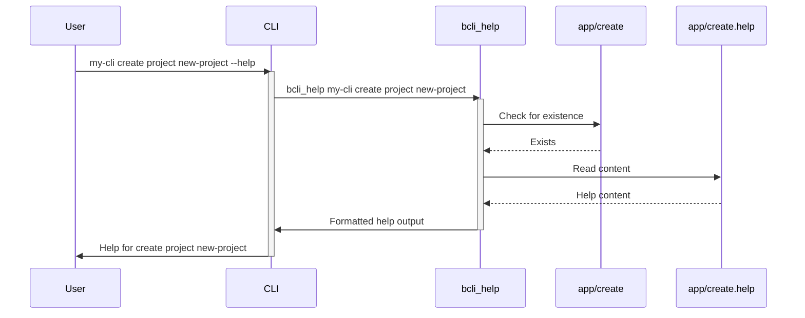

# Help Generation

Imagine you're using a command-line tool and get stuck.  Help generation is the system that guides you, providing information about available commands and their usage. This chapter explains how `bash-cli` displays help information, enabling users to understand and effectively use available commands.

## How Help is Triggered

There are three main ways to trigger help information in `bash-cli`:

* **Explicitly:** Using the `help` command.
* **Implicitly (Incomplete/Invalid Command):** Entering an incomplete or invalid command.
* **Implicitly (Command Script):** A command script exiting with code 3 or receiving the `--help` argument.

## Understanding Help Sources

`bash-cli` leverages `.help` and `.usage` files associated with commands or directories to generate help output.  For directories, the help output also lists available subcommands.

### `.help` Files

These files contain detailed explanations of a command or directory's purpose, arguments, and options.  The `create` command automatically generates a template `.help` file:

```bash
cat > "$CMD_DIR/$CMD_NAME.help" <<EOT
ARGS  - The arguments you wish to provide to this command

TODO: Fill out the help information for this command.
EOT
```

This snippet from `app/command/create.sh` shows how a `.help` file is created containing placeholder text for command arguments and a reminder to add specific help information.

### `.usage` Files

These files specify the expected usage syntax for a command.  Similar to the `.help` file, the `create` command generates a `.usage` file:

```bash
echo "ARGS..." > "$CMD_DIR/$CMD_NAME.usage"
```

This snippet, also from `app/command/create.sh`, demonstrates the creation of a `.usage` file with placeholder arguments.

## Generating Help Output: The `bcli_help` Function

The core logic for help generation resides in the `bcli_help` function (located in `bash-cli.inc.sh`). This function dynamically constructs help output based on the provided arguments and the presence of `.help` and `.usage` files.

###  Internal Implementation

Here's a simplified sequence diagram illustrating how `bcli_help` works when requesting help for the `my-cli create project new-project` command:



###  Code Deep Dive

The following snippet from `bash-cli.inc.sh` shows how `bcli_help` locates the appropriate help file:

```bash
local help_file="$root_dir/app/"
local help_arg_start=2
while [[ -d "$help_file" && $help_arg_start -le $# ]]; do
    help_file="$help_file/${!help_arg_start}"
    help_arg_start=$((help_arg_start+1))
done
```
This loop iterates through the provided command arguments, traversing the directory structure within the `app` directory to locate the target command or directory for which help is requested.

And this snippet demonstrates how `bcli_help` reads and displays the content of the `.help` file:

```bash
if [[ -f "$help_file.help" ]]; then
    cat "$help_file.help"
    echo ""
fi
```
This ensures the corresponding `.help` file, if present, is displayed to the user.  Similar logic handles `.usage` files.

## Solving the Use Case: Getting Help

Let's say you want to learn about the `create` command. You would run:

```bash
my-cli help create
```

This would trigger `bcli_help`, which would locate the `app/create` command and display its associated `.help` and `.usage` content, providing information on how to use the command.


## Conclusion

Help generation in `bash-cli` provides a user-friendly way to access information about available commands and their usage. The combination of explicit and implicit help triggers, coupled with the use of `.help` and `.usage` files, allows for a flexible and informative help system.  For further details on how command completion works within this framework, see the [Bash Completion Logic](04_bash_completion_logic_.md) chapter.


---

Generated by [AI Codebase Knowledge Builder](https://github.com/The-Pocket/Doc-Codebase-Knowledge)