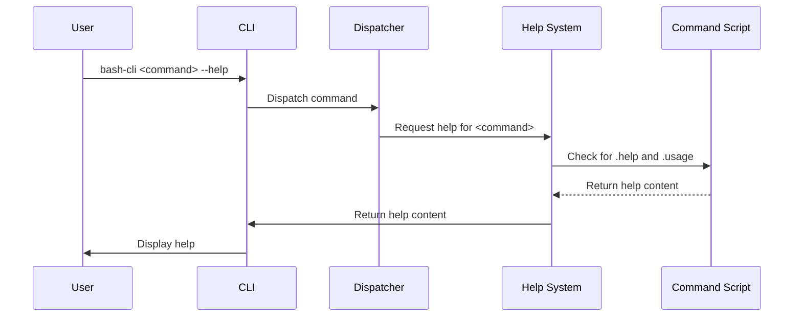

# Help Generation

This chapter explains how the `bash-cli` framework generates help documentation, allowing your users to understand how to use your CLI.  Imagine a user trying to use your CLI but is unsure of the available commands or the arguments a specific command takes. The help generation system addresses this by providing clear usage instructions. This chapter will guide you through how this works.

## Understanding Help Generation

Help generation is the system that displays helpful information to the user.  It solves the problem of users not knowing how to interact with the CLI. It’s activated in three ways: using the `help` command, entering an incomplete or incorrect command, or when a command script exits with code 3 or receives the `--help` argument.

The help system constructs its output by reading `.help` and `.usage` files located alongside commands or within directories. For directories, it lists available subcommands. The core logic for this process is within the `bcli_help` function.


## Using Help

### Getting Help for a Command

To get help for a specific command, use the following syntax:

```bash
bash-cli help <command> <subcommand> ...
```

For example, if you have a command `bash-cli create project my-project` and want to understand its usage, you would run:

```bash
bash-cli help create project
```

This will display the contents of `app/create/project.help` and `app/create/project.usage` files.

### Triggering Help Implicitly

Help is also shown when a command is used incorrectly or incompletely.  For instance, if you type an invalid command:

```bash
bash-cli invalid-command
```

The system will try to find the closest matching directory and show its help, effectively guiding the user toward valid commands.  Similarly, if a directory is accessed without specifying a subcommand:

```bash
bash-cli create
```

The help for the `create` directory will be displayed, listing available subcommands.  Also, a command script can trigger help by exiting with code 3, or implementing the `--help` argument itself.

## Internal Implementation

Here’s a simplified sequence diagram illustrating how help generation works:



The `bcli_help` function ([Core Function Library
](07_core_function_library_.md)) within `bash-cli.inc.sh` manages help generation.


```bash
# bash-cli.inc.sh
function bcli_help() {
    # ... (Initialization and argument parsing)

    # Locate the appropriate help file
    # ...

    # Display help for a directory
    if [[ -d "$help_file" ]]; then
        # ... (Display directory help and list subcommands)
        exit 0
    fi

    # Display help for a command
    echo -en "${COLOR_GREEN}$cli_entrypoint ${COLOR_CYAN}${*:2:$((help_arg_start-1))} ${COLOR_NORMAL}"
    # ... (Display .usage and .help content)
}
```

The `bcli_help` function identifies whether the help request is for a command file or a directory and displays the appropriate `.usage` and `.help` files. Refer to the [Command Structure & Metadata
](01_command_structure___metadata_.md) chapter to understand how command metadata and structure play a role here.  The [Command Dispatcher
](02_command_dispatcher_.md) chapter explains how incorrect or incomplete commands are routed to the help system.

## Example: Creating Help for a Command

When you create a command using `bash-cli create <command>`, stub `.usage` and `.help` files are generated automatically.

```bash
# app/command/create.sh (snippet)
cat > "$CMD_DIR/$CMD_NAME.help" <<EOT
ARGS  - The arguments you wish to provide to this command

TODO: Fill out the help information for this command.
EOT
```

You can then edit these files to provide user-specific instructions.

## Troubleshooting

If the help is not displaying as expected, double-check that the `.help` and `.usage` files are correctly placed in the respective command directories within the `app` folder.

## Conclusion

Help generation is a crucial aspect of building user-friendly CLIs. `bash-cli` provides a robust system for creating and displaying help documentation, making it easier for users to understand and utilize your CLI effectively.

[Next Chapter Title: Bash Completion Logic](04_bash_completion_logic_.md)


---

Generated by [AI Codebase Knowledge Builder](https://github.com/The-Pocket/Doc-Codebase-Knowledge)