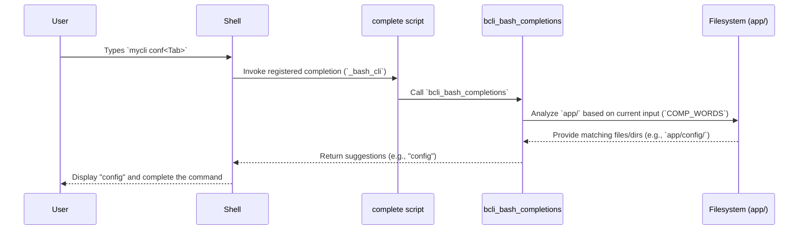

# Bash Completion Logic

In the previous chapter, [Help Generation](03_help_generation_.md), we explored how `bash-cli` provides users with information about commands. This chapter introduces another powerful user-assistance feature: Bash completion, which helps users type commands more quickly and accurately by offering suggestions interactively.

Bash completion allows users to press the `Tab` key to automatically complete partially typed commands, subcommands, or suggest available options, significantly improving the command-line experience. `bash-cli` integrates this feature by analyzing your command structure and providing relevant suggestions based on the current input.

## What is bash completion?

Imagine you want to run the command `mycli config set --key api_key`. Instead of typing the whole thing, bash completion lets you do something like this:

1.  Type `mycli conf<Tab>` -> Shell completes to `mycli config `
2.  Type `s<Tab>` -> Shell completes to `mycli config set `
3.  Type `--<Tab>` -> Shell suggests `--help` (and potentially other options)

This reduces typing, prevents typos, and helps users discover available commands and options without constantly referring to help documentation.

## Key Concepts

`bash-cli`'s completion system relies on these core ideas:

1.  **Interactive Suggestions:** Completion suggestions appear directly in the terminal when the user presses the `Tab` key.
2.  **Context-Awareness:** The suggestions provided depend on the command parts already typed by the user.
3.  **Command Structure Analysis:** The system leverages the directory structure within `app/`, as described in [Command Structure & Metadata](01_command_structure___metadata_.md). Directories suggest command groups or subcommands, while executable files suggest commands.
4.  **`bcli_bash_completions` Function:** This core function, located in `bash-cli.inc.sh`, contains the logic to parse the current command line and generate appropriate suggestions based on the `app/` structure.
5.  **Integration via `complete` Script:** A helper script named `complete` acts as a bridge. It sources the necessary functions and calls `bcli_bash_completions`. This script is registered with Bash's built-in `complete` command during the [CLI Installation & Uninstallation](05_cli_installation___uninstallation_.md) process.
6.  **`--help` Suggestion:** For any valid command path identified, the completion system automatically suggests the `--help` argument.
7.  **Custom Completions (`.complete` files):** You can provide custom completion suggestions for the arguments of a specific command by creating a corresponding `.complete` file (e.g., `app/config/set.complete`).

## How it works

When a user presses `Tab` while typing a command for your `bash-cli` application (e.g., `mycli`), the shell invokes the registered completion function.

**Use Case:** User wants to explore and complete commands.

1.  **Input:** `mycli <Tab>`
    *   **Action:** The shell triggers the `complete` script, which calls `bcli_bash_completions`.
    *   **Logic:** `bcli_bash_completions` analyzes the top level of the `app/` directory.
    *   **Output:** Suggests available top-level commands and directories (e.g., `config`, `user`, `status`, `help`).

2.  **Input:** `mycli config <Tab>`
    *   **Action:** Shell triggers completion again.
    *   **Logic:** `bcli_bash_completions` identifies `config` corresponds to the `app/config/` directory and lists its contents.
    *   **Output:** Suggests subcommands within `app/config/` (e.g., `list`, `set`) and the generic `help` command.

3.  **Input:** `mycli config set <Tab>`
    *   **Action:** Shell triggers completion.
    *   **Logic:** `bcli_bash_completions` identifies `set` corresponds to the `app/config/set` command file.
    *   **Output:** Suggests the standard `--help` argument. If `app/config/set.complete` exists, it also sources that file to generate custom argument suggestions.

## Internal Implementation

The completion mechanism involves the user's shell, the registered `complete` script, and the `bcli_bash_completions` function interacting with the filesystem.



### Registration during Installation

The link between your CLI command and the completion logic is established during installation (handled by `app/install.sh`). It creates a file in `/etc/bash_completion.d/` (or a similar location) that tells Bash to use the `_bash_cli` function (defined in the `complete` script) for your command.

```bash
# --- From: app/install.sh ---
# ... (Determine NAME and APP_DIR) ...

# Create the bash completion configuration file
cat > "/etc/bash_completion.d/$NAME" <<EOC
# Source the script containing the _bash_cli function
source "$APP_DIR/complete"
# Register _bash_cli to handle completion for the command $NAME
complete -F _bash_cli $NAME
EOC
```

This configuration ensures that when the user types `<your_cli_name> <Tab>`, Bash knows to call the `_bash_cli` function.

### The `complete` Script

This script is very simple. Its main purpose is to find the location of your CLI project, source the `bash-cli.inc.sh` library (which contains `bcli_bash_completions`), and then define the `_bash_cli` function that Bash calls.

```bash
# --- From: complete ---
#!/usr/bin/env bash

# Helper to find the real path (simplified)
bcli_realpath() {
    # ... logic to resolve symbolic links ...
    echo "$resolved_path"
}

# This is the function registered with Bash's `complete` command
function _bash_cli() {
    local root_dir;
    # Find the directory where the CLI script lives
    root_dir=$(dirname "$(bcli_realpath "$(which "${COMP_WORDS[0]}")")")

    # Load the main library file containing bcli_bash_completions
    # shellcheck source=./bash-cli.inc.sh
    . "$root_dir/bash-cli.inc.sh"

    # Call the core completion logic function
    bcli_bash_completions
}
```

### `bcli_bash_completions` Function

This function performs the actual work of generating suggestions. It uses special Bash variables provided during completion:
*   `COMP_WORDS`: An array containing the individual words typed so far on the command line.
*   `COMP_CWORD`: The index of the word the cursor is currently on.
*   `COMPREPLY`: An array where the function places the generated suggestions.

**1. Traversing the Command Path:**
The function first determines the command path already typed, similar to the [Command Dispatcher](02_command_dispatcher_.md).

```bash
# --- From: bash-cli.inc.sh (within bcli_bash_completions) ---
local cmd_file="$root_dir/app/"
local cmd_arg_start=1
# Loop through typed words matching directories
while [[ -d "$cmd_file" && $cmd_arg_start -lt $COMP_CWORD ]]; do
    # Handle 'help' pseudo-command if needed
    # ...
    cmd_file="$cmd_file/${COMP_WORDS[cmd_arg_start]}"
    cmd_arg_start=$((cmd_arg_start+1))
done

# Get the word currently being typed
local curr_arg="${COMP_WORDS[COMP_CWORD]}"
cmd_file="$cmd_file/$curr_arg" # Tentative full path
```

**2. Suggesting Subcommands (Directory Found):**
If the path determined so far points to a directory, it lists the commands and sub-directories within it.

```bash
# --- From: bash-cli.inc.sh (within bcli_bash_completions) ---

# If the current path resolves to a directory...
if [ -d "$(dirname "$cmd_file")" ]; then
    local current_dir # Path to list contents from
    current_dir=$(dirname "$cmd_file")

    local opts=("help") # Always suggest 'help'
    # Find executable files or directories not containing dots
    while IFS= read -d $'\0' -r file ; do
        opts+=("$(basename "$file")")
    done < <(find "$current_dir"/ -maxdepth 1 ! -path "$current_dir"/ ! -iname '*.*' -print0)

    # Use compgen to filter suggestions based on current word
    # shellcheck disable=SC2207
    COMPREPLY=($(compgen -W "$(printf '%s\n' "${opts[@]}")" -- "$curr_arg"))
fi
```

**3. Suggesting Arguments (Command Found):**
If the path points to an executable command file, it suggests `--help` and checks for a custom `.complete` file.

```bash
# --- From: bash-cli.inc.sh (within bcli_bash_completions) ---

# Adjust path back if we tentatively added the current word
cmd_file="${cmd_file%/$curr_arg}" # Get path to the command itself

# If the path is a file (a command script)...
if [[ -f "$cmd_file" ]]; then
    local suggestions="--help" # Always suggest --help

    # Check for a custom completion file
    if [ -f "${cmd_file}.complete" ]; then
        # Source the custom file to get more suggestions
        # The .complete script should echo space-separated suggestions
        # shellcheck disable=SC1090 # Sourcing dynamic file is intended
        custom_suggestions=$(source "${cmd_file}.complete")
        suggestions="$suggestions $custom_suggestions"
    fi

    # Use compgen to filter suggestions
    # shellcheck disable=SC2207
    COMPREPLY=($(compgen -W "$suggestions" -- "$curr_arg"))
    return
fi
```

### Custom Completions with `.complete` Files

To provide specific argument suggestions for a command like `app/config/set`, create an executable file named `app/config/set.complete`. This script should simply echo a space-separated list of possible completions.

**Example:** `app/config/set.complete`

```bash
#!/usr/bin/env bash

# Suggest common keys and output formats
echo "--key --value --format json yaml"
```

When the user types `mycli config set --<Tab>`, `bcli_bash_completions` will execute this `.complete` script and add its output (`--key`, `--value`, `--format`, `json`, `yaml`) to the suggestions alongside `--help`.

## Conclusion

Bash completion is a vital feature for a user-friendly CLI. `bash-cli` provides a robust system that automatically generates completions for commands and subcommands based on your `app/` directory structure. It requires minimal setup, integrates seamlessly during installation, suggests the standard `--help` argument, and allows for extension with custom `.complete` files for command-specific arguments. This significantly enhances the usability and discoverability of your CLI application.

Next, we will cover how the CLI application itself is installed and managed on a user's system in the [CLI Installation & Uninstallation](05_cli_installation___uninstallation_.md) chapter.

---

Generated by [AI Codebase Knowledge Builder](https://github.com/The-Pocket/Doc-Codebase-Knowledge)