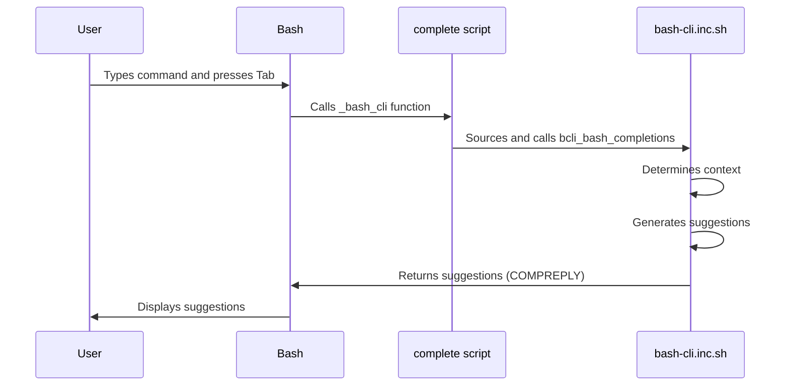

# Bash Completion Logic

This chapter explains how bash completion works in `bash-cli`, enabling interactive command suggestions as you type.  Imagine you're using a CLI with many nested commands and arguments; typing everything out manually can be tedious and error-prone. Bash completion solves this by suggesting available commands, subcommands, and the `--help` argument as you type.

## Concept: Auto-completion in Bash

Bash completion enhances the user experience by predicting and suggesting possible completions for commands and their arguments. This reduces typing errors and speeds up command entry, especially for complex CLIs.  It leverages the `complete` bash builtin and completion scripts to provide context-aware suggestions.

## Enabling bash completion for your CLI

This section explains how bash completion is implemented and integrated into the `bash-cli` project.

### Installation and the `complete` script

During [CLI Installation & Uninstallation](05_cli_installation___uninstallation_.md), the `install.sh` script registers the completion logic.  It creates a file in `/etc/bash_completion.d/` that sources the `complete` script and registers the `_bash_cli` function for the installed CLI. This ensures completion is available whenever you use the CLI.

```bash
# File: app/install.sh (simplified)
cat > "/etc/bash_completion.d/<CLI_NAME>" <<EOC
source "<APP_DIR>/complete"
complete -F _bash_cli <CLI_NAME>
EOC
```

This code snippet from `app/install.sh` creates a bash completion definition file for `<CLI_NAME>`. It sources the `complete` script which contains the `_bash_cli` function, and tells bash to use that function for completions for `<CLI_NAME>`.


### The `_bash_cli` function

The `complete` script defines the `_bash_cli` function, which acts as the entry point for completion suggestions. It sources the `bash-cli.inc.sh` file, which contains the core completion logic, and calls `bcli_bash_completions`.

```bash
# File: complete (simplified)
_bash_cli() {
    . "<ROOT_DIR>/bash-cli.inc.sh"
    bcli_bash_completions
}
```

This code snippet shows the `_bash_cli` function, which is called by bash whenever completion is triggered for the registered CLI name. This function sources `bash-cli.inc.sh` to include necessary helper functions, then calls the `bcli_bash_completions` function to perform the actual completion logic.

### The `bcli_bash_completions` function

This function in `bash-cli.inc.sh` analyzes the current command, determines the context ([Command Structure & Metadata](01_command_structure___metadata_.md)), and generates appropriate suggestions. It uses `find` to list available subcommands in a directory and `compgen` to filter suggestions based on user input.  It also always suggests `--help`.  Custom completions can be added via `.complete` files next to command files. These custom completions should output words separated by spaces, and can be dynamic based on any logic the user wants.


```bash
# File: bash-cli.inc.sh (simplified - directory completion)
bcli_bash_completions() {
  # ... (Context determination - see Command Dispatcher)
  if [ -d "$cmd_file" ]; then
    # ... (Building list of subcommands)
    COMPREPLY=($(compgen -W "$(printf '%s\n' "${opts[@]}")" -- "$curr_arg"))
  fi
}
```

This simplified code snippet shows how directory completion works. It uses `find` to get a list of subcommands in the current directory, and `compgen` to filter and present those options to the user.  This code has been significantly simplified; refer to the full `bash-cli.inc.sh` file for the complete implementation, including `--help` generation and custom completions.

### Sequence Diagram



## Example Usage

If you have a command `mycli tool subtool`, typing `mycli tool s` and pressing Tab will suggest `subtool`. Typing `mycli tool subtool ` and pressing Tab will suggest `--help`, and any custom completions provided by a `subtool.complete` file alongside the `subtool` executable.


## Conclusion

Bash completion significantly improves the user experience of `bash-cli` based CLIs. It provides context-aware suggestions, reducing typing errors and making complex commands easier to use. The system is flexible enough to accommodate custom completion logic as needed.  Next, let's explore how to install and uninstall your CLI: [CLI Installation & Uninstallation](05_cli_installation___uninstallation_.md).


---

Generated by [AI Codebase Knowledge Builder](https://github.com/The-Pocket/Doc-Codebase-Knowledge)