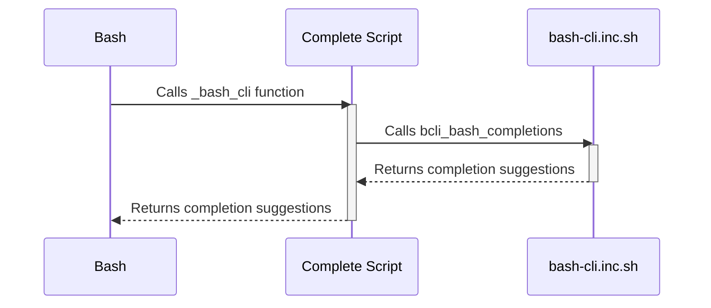

# Bash Completion Logic

This chapter explains how bash completion works in `bash-cli`, enabling interactive command suggestions as you type.  Imagine you're using a command-line tool with many subcommands and options. Typing everything out manually can be tedious and error-prone. Bash completion solves this by suggesting available commands, subcommands, and the `--help` argument as you type, improving efficiency and reducing errors.

## Concept: Auto-completion for Commands and Arguments

Bash completion enhances the command-line experience by dynamically suggesting possible completions for commands and their arguments.  This is triggered when the user presses the Tab key.  This helps users discover available commands, remember their syntax, and avoid typos.

### How Bash Completion Works

`bash-cli` analyzes the directory structure within the `app/` directory to understand the available commands and subcommands.  It leverages the `bcli_bash_completions` function to generate these suggestions.  During installation, the `complete` script integrates this functionality into the system's bash completion mechanism.

## Procedure: Enabling bash completion

This section guides you on how bash completion is integrated during installation.

### Prerequisites

- A `bash-cli` project initialized using the `init` command (covered in a later chapter).
- Installation script ready to be executed.

### Installation Steps

1.  The installation process begins by creating a symbolic link from the `cli` script in your project's root directory to the desired installation location (e.g., `/usr/bin/<CLI name>`).  This makes the CLI accessible system-wide.

    ```bash
    ln -s "$APP_DIR/cli" "$FOLDER/$NAME"
    ```

    This command creates a symbolic link named `<NAME>` in the `<FOLDER>` directory, pointing to the `cli` script in your project directory.

2.  Next, a completion script is added to `/etc/bash_completion.d/`.  This script tells bash how to perform completions for your CLI.

    ```bash
    cat > "/etc/bash_completion.d/$NAME" <<EOC
    source "$APP_DIR/complete"
    complete -F _bash_cli $NAME
    EOC
    ```

    This command creates a file named `<NAME>` in `/etc/bash_completion.d/`.  The content sources the `complete` script from your project and registers the `_bash_cli` function as the completion function for your CLI.


### Verification

Open a new terminal and try typing the first few letters of your CLI's name followed by the Tab key.  Bash should suggest the full name of your CLI.

### Troubleshooting

If completion doesn't work, ensure the installation script ran successfully and that the files in `/etc/bash_completion.d/` are sourced correctly by your bash configuration.

## Reference: Core Components of Bash Completion

The following components are key to understanding the bash completion logic:

-   `app/`:  The directory structure within `app/` defines the available commands and subcommands.
-   `bcli_bash_completions`: The core function that generates completion suggestions based on the current input and the `app/` directory structure. This function is defined in `bash-cli.inc.sh`.
-   `complete`:  The script responsible for integrating the completion logic with bash. This script sources `bash-cli.inc.sh` to access the `bcli_bash_completions` function.
-   `.complete` files: Optional files within the `app/` directory that allow developers to add custom completion logic for specific commands (see below).

## Concept: Custom Command Completions

You can further customize completion by creating `.complete` files. Let's say you have a command `app/mycommand` that takes a filename as an argument.  You could create `app/mycommand.complete` to provide file completion for that argument.  This is implemented within the `bcli_bash_completions` function found in `bash-cli.inc.sh`:


```bash
# ... inside bcli_bash_completions
if [ -f "${cmd_file}.complete" ]; then
    COMPREPLY=($(compgen -W "--help $(source "${cmd_file}.complete")" -- "$curr_arg" ) )
    return
# ...
```
If a `.complete` file is present alongside the command, it's sourced, and its output, along with `--help`, is used for completion suggestions.  For our example, the `.complete` file could contain:

```bash
# app/mycommand.complete
*.txt
```
This would suggest all `.txt` files in the current directory.


## Internal Implementation

The following sequence diagram illustrates the interaction between bash, the `complete` script, and `bash-cli.inc.sh` during completion:



Bash triggers the registered completion function (`_bash_cli`).  The `_bash_cli` function, defined within `complete`, calls the `bcli_bash_completions` function from `bash-cli.inc.sh`. The `bcli_bash_completions` function analyzes the command structure within the `app/` directory and current input, then returns completion suggestions back to bash.


## Conclusion

Bash completion significantly improves the user experience of `bash-cli` projects.  By providing interactive suggestions, it streamlines command execution and minimizes errors.  [CLI Installation & Uninstallation](05_cli_installation___uninstallation_.md) is the next chapter.


---

Generated by [AI Codebase Knowledge Builder](https://github.com/The-Pocket/Doc-Codebase-Knowledge)