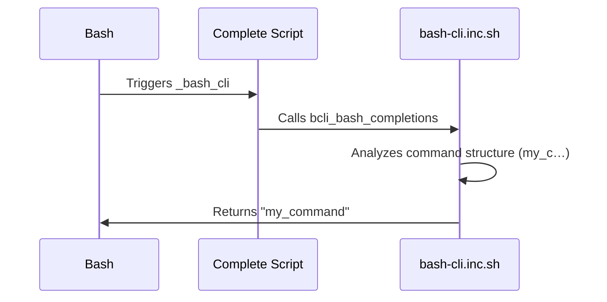

# Bash Completion Logic

This chapter explains how bash completion works in `bash-cli`, enabling interactive command suggestions as you type. Imagine you're using a new CLI tool and can't quite remember the exact command or its options.  Bash completion solves this by providing suggestions as you type, improving usability and reducing errors.  This chapter will guide you through how `bash-cli` implements this helpful feature.

## Concept: Auto-completion

Bash completion enhances the command-line experience by dynamically suggesting available commands, subcommands, and arguments as the user types. This predictive behavior is triggered by the Tab key and relies on analyzing the command structure and metadata. It is essential for user-friendliness, especially with complex CLIs.

## Enabling Interactive Command Suggestions

`bash-cli` uses a combination of shell scripts and metadata files within the `app/` directory to offer intelligent bash completions. The core logic resides in the `bcli_bash_completions` function, which is called by the `complete` script. Let's explore this process step-by-step.

### Installation and Registration

During the installation of your CLI (see [CLI Installation & Uninstallation](05_cli_installation___uninstallation_.md)), the `install.sh` script registers the completion logic with bash.

```bash
# ... (Other installation logic)

cat > "/etc/bash_completion.d/<cli_name>" <<EOC
source "$APP_DIR/complete"
complete -F _bash_cli <cli_name>
EOC
```

This snippet creates a file in `/etc/bash_completion.d/` named after your CLI (`<cli_name>`).  This file sources the `complete` script and registers the `_bash_cli` function as the completion handler for your CLI.

### The `complete` Script

The `complete` script acts as a bridge between bash and the `bcli_bash_completions` function.

```bash
# ... (realpath function) ...

function _bash_cli() {
    # ... (Locates project root)

    # Includes core functions
    . "$root_dir/bash-cli.inc.sh" 

    bcli_bash_completions
}
```

This script defines the `_bash_cli` function which is invoked by bash whenever tab completion is triggered for your CLI.  It sources `bash-cli.inc.sh` which contains the `bcli_bash_completions` function.

### The `bcli_bash_completions` Function

This function within `bash-cli.inc.sh` is the heart of the completion logic. It analyzes the command structure defined in the [Command Structure & Metadata](01_command_structure___metadata_.md) and generates completion suggestions based on the current input context.  It handles command, subcommand, and `--help` argument completion. See the full source code in the `bash-cli.inc.sh` file.

```bash
function bcli_bash_completions() {
    # ... (Logic to determine current context - command, subcommand, etc.)

    if [[ -f "$cmd_file" ]]; then # Completion for commands
        # ... (Suggest --help and handle .complete files)
    elif [ -d "$cmd_file" ]; then # Completion for subcommands
        # ... (List available subcommands and help)
    fi
}
```

### Custom Command Completions

You can add custom completions for individual commands by creating a `.complete` file next to the corresponding command file in the `app/` directory.  For example, for a command `app/my_command`, create a file named `app/my_command.complete`. The `bcli_bash_completions` function sources this file to provide custom completions.


## Example: Completing the `my_command`

Let's assume your CLI is named `mycli` and you have a command `app/my_command`. When the user types `mycli my_c` and presses Tab, the following simplified sequence of events occurs:



## Conclusion

Bash completion significantly improves the user experience by providing interactive command suggestions. `bash-cli` simplifies the implementation of this feature, allowing you to focus on building your CLI's functionality.  The next chapter covers [CLI Installation & Uninstallation](05_cli_installation___uninstallation_.md). 


---

Generated by [AI Codebase Knowledge Builder](https://github.com/The-Pocket/Doc-Codebase-Knowledge)