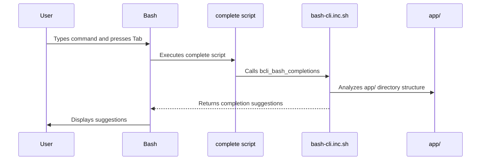

# Bash Completion Logic

This chapter explains how bash completion works in `bash-cli`, allowing you to use the Tab key for interactive command suggestions.  Imagine you are using a new CLI tool and cannot remember all the available commands or arguments. Bash completion solves this by dynamically suggesting completions as you type. This chapter will guide you through how `bash-cli` makes this happen.

## Key Concepts

Bash completion in `bash-cli` hinges on these core concepts:

* **Command Structure Analysis:** The completion system analyzes the directory structure within `app/` to understand the available commands and subcommands.  This structure mirrors the CLI's command hierarchy.  See [Command Structure & Metadata](01_command_structure___metadata_.md) for more details.

* **Dynamic Suggestion Generation:** The `bcli_bash_completions` function dynamically generates completion suggestions based on the current command context. It analyzes the command being typed and suggests relevant commands, subcommands, and arguments.

* **Integration with Bash Completion System:** The `complete` script integrates the `bcli_bash_completions` function with Bash's built-in completion mechanism using the `complete` command. This ensures that the Tab key triggers the completion process.  The integration is set up during [CLI Installation & Uninstallation](05_cli_installation___uninstallation_.md).

* **Custom Command Completions:** You can add custom completions for specific commands by creating `.complete` files alongside your command scripts.  These files allow providing fine-grained control over the completion suggestions for each command.

## Using Bash Completion

To use bash completion, simply type the beginning of a command within your `bash-cli` project and press the Tab key.

**Example:**

```bash
mycli <Tab>
```

`bash-cli` will suggest all available top-level commands within the `app/` directory.  If you type `mycli command1 <Tab>`, it will then suggest subcommands or arguments relevant to `command1`.  The `--help` argument is always suggested as a possibility.

## Internal Implementation

The following sequence diagram illustrates how bash completion works within `bash-cli`:



### Code Deep Dive

1. **Installation (`app/install.sh`):**

```bash
complete -F _bash_cli <cli_name>
```
This line in `app/install.sh` registers the `_bash_cli` function (defined in the `complete` script) as the completion handler for `<cli_name>`.

2. **Completion Handler (`complete`):**

```bash
. "$root_dir/bash-cli.inc.sh"
bcli_bash_completions
```

The `complete` script sources `bash-cli.inc.sh` to include the core functions and then calls `bcli_bash_completions`.

3. **Core Completion Logic (`bash-cli.inc.sh`):**

The `bcli_bash_completions` function in `bash-cli.inc.sh` performs the following steps:

* Determines the current command context by analyzing the `COMP_WORDS` and `COMP_CWORD` variables provided by Bash.
* Uses the [Command Dispatcher](02_command_dispatcher_.md) logic to traverse the `app/` directory structure and identify the relevant command or subcommand.
* If a command file is found, suggests `--help` (and potentially options from a `.complete` file if present.)
* If a directory is found, suggests available subcommands and the `help` virtual command.


## Conclusion

Bash completion simplifies CLI interaction by providing dynamic command suggestions.  This chapter has demonstrated how `bash-cli` implements and integrates this functionality using directory structure analysis and the `bcli_bash_completions` function. Next, let us learn about how the CLI is installed and uninstalled: [CLI Installation & Uninstallation](05_cli_installation___uninstallation_.md). 


---

Generated by [AI Codebase Knowledge Builder](https://github.com/The-Pocket/Doc-Codebase-Knowledge)