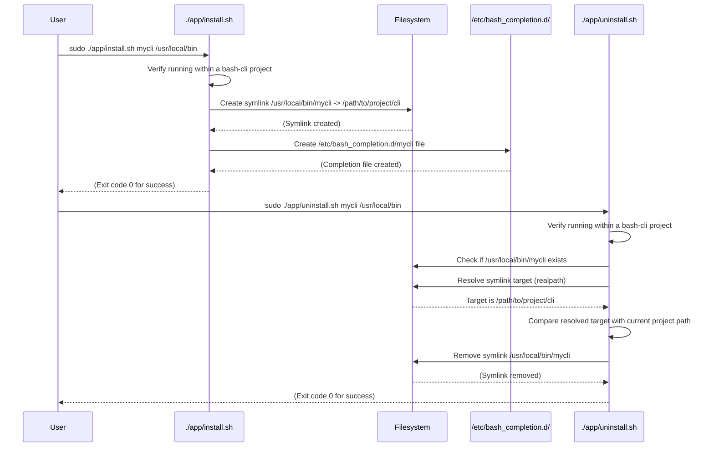

# CLI Installation & Uninstallation


In the previous chapter, [Bash Completion Logic](04_bash_completion_logic_.md), we saw how `bash-cli` enhances usability by providing command completion. Now, how do we make the CLI tool you have developed accessible system-wide, just like standard commands such as `ls` or `git`? This chapter explains the process of installing and uninstalling your `bash-cli` application using the provided helper scripts.

This process involves making your main `cli` script runnable from any directory by creating a symbolic link in a standard system location and setting up the bash completion script discussed previously.

## Key Concepts

1.  **Global Accessibility:** The goal is to run your CLI command (e.g., `mycli`) directly from the terminal, regardless of your current working directory, without needing to specify the full path to the script.
2.  **Symbolic Link (Symlink):** This is a special type of file that acts as a pointer or shortcut to another file or directory. The installation script creates a symlink from a directory in the system's `PATH` to your project's main `cli` entrypoint script.
3.  **System `PATH`:** An environment variable that lists directories the shell searches for executable commands. Common directories include `/usr/bin`, `/usr/local/bin`, and `/opt/bin`. Placing the symlink in one of these directories makes the command globally accessible.
4.  **Permissions:** Creating files or links in system directories like `/usr/local/bin` typically requires administrator privileges (e.g., using `sudo`).
5.  **Bash Completion Setup:** The installation script also registers the bash completion logic (covered in [Bash Completion Logic](04_bash_completion_logic_.md)) for your command, enabling `Tab` completion system-wide.
6.  **`install.sh` Script:** Located in `app/install.sh`, this script handles the creation of the symbolic link and the bash completion configuration file.
7.  **`uninstall.sh` Script:** Located in `app/uninstall.sh`, this script removes the symbolic link created by `install.sh`. It includes checks to ensure it only removes links pointing to the correct project.

## Using the Installation and Uninstallation Scripts

These scripts provide a standardized way to manage your CLI's presence on the system.

### Installing the CLI

To make your CLI available globally.

**Use Case:** Install your project's CLI so it can be run using the command `mycli`, placing the link in `/usr/local/bin`.

**Prerequisites:**

*   You must be inside your `bash-cli` project directory.
*   You need write permissions to the target installation directory (e.g., `/usr/local/bin`). This usually means running the command with `sudo`.

**Input:**

Navigate to your project's root directory in the terminal and run:

```bash
sudo ./app/install.sh mycli /usr/local/bin
```

*   `mycli`: The desired command name users will type.
*   `/usr/local/bin`: The target directory within the system `PATH`. If omitted, it defaults to `/usr/bin`. `/usr/local/bin` is often preferred for user-installed software.

**Result:**

If successful, the script will perform two main actions:

1.  Create a symbolic link: `/usr/local/bin/mycli` pointing to `/path/to/your/project/cli`.
2.  Create a bash completion configuration file: Typically `/etc/bash_completion.d/mycli`, which enables tab completion for the `mycli` command.

You might need to restart your shell session or source the completion files (e.g., `source /etc/bash_completion`) for the command and completion to become active immediately.

### Uninstalling the CLI

To remove the globally accessible command link.

**Use Case:** Remove the `mycli` command previously installed in `/usr/local/bin`.

**Prerequisites:**

*   You must be inside the *same* `bash-cli` project directory from which the CLI was originally installed.
*   You need write permissions to the directory containing the link (usually requires `sudo`).

**Input:**

Navigate to your project's root directory and run:

```bash
sudo ./app/uninstall.sh mycli /usr/local/bin
```

*   `mycli`: The command name that was installed.
*   `/usr/local/bin`: The directory where the link was created. Defaults to `/usr/bin` if omitted.

**Result:**

The script performs checks to ensure the link `/usr/local/bin/mycli` exists and points to the `cli` script within the *current* project directory. If the checks pass, it will:

1.  Remove the symbolic link: `/usr/local/bin/mycli`.

*Note: The current version of `uninstall.sh` removes the command symlink but does not automatically remove the corresponding bash completion file (e.g., `/etc/bash_completion.d/mycli`). This might need to be removed manually.*

## Internal Implementation

The `install.sh` and `uninstall.sh` scripts primarily interact with the filesystem to manage the symlink and completion configuration.



### Code Snippets (`install.sh`)

**1. Project Context Check:**
Ensures the script is run from within a valid `bash-cli` project directory by looking for the marker file `.bash_cli`.

```bash
# --- From: app/install.sh ---
APP_DIR=$(pwd)

# Navigate up if run from app/ subdirectory
if [[ -f "$APP_DIR/.bash_cli" ]]; then
    APP_DIR=$(dirname "$APP_DIR")
fi

# Check for marker file in the expected location
if [[ ! -f "$APP_DIR/app/.bash_cli" ]]; then
    >&2 echo -e "\033[31mYou are not within a Bash CLI project\033[39m"
    # ... (error message) ...
    exit 1
fi
```

**2. Creating the Symbolic Link:**
Uses the standard `ln -s` command.

```bash
# --- From: app/install.sh ---
NAME="$1" # e.g., "mycli"
FOLDER="${2-"/usr/bin"}" # e.g., "/usr/local/bin"

# Create the symbolic link
# Example: ln -s /path/to/project/cli /usr/local/bin/mycli
ln -s "$APP_DIR/cli" "$FOLDER/$NAME"
```

**3. Creating the Bash Completion File:**
Writes the necessary configuration to the system's bash completion directory.

```bash
# --- From: app/install.sh ---

# Write completion config file (e.g., /etc/bash_completion.d/mycli)
cat > "/etc/bash_completion.d/$NAME" <<EOC
# Source the project's complete script which defines _bash_cli
source "$APP_DIR/complete"
# Register the _bash_cli function for the command $NAME
complete -F _bash_cli $NAME
EOC
```
This file tells Bash to use the `_bash_cli` function (defined in your project's `complete` script, which uses `bcli_bash_completions` from `bash-cli.inc.sh`) whenever the user tries to tab-complete the `$NAME` command.

### Code Snippets (`uninstall.sh`)

**1. Verifying Link Target:**
Before removing the link, it checks if the link actually points to the `cli` script in the current project directory. This prevents accidentally removing a different command with the same name.

```bash
# --- From: app/uninstall.sh ---
NAME="$1"
FOLDER="${2-"/usr/bin"}"

# Check if the link exists
if [[ ! -f "$FOLDER/$NAME" ]]; then
    >&2 echo -e "\033[31mCommand \033[36m$1\033[31m did not exist...\033[39m"
    exit 1
fi

# Get the real, absolute path the link points to
LN_PATH=$(realpath "$FOLDER/$NAME")

# Compare the link's target with the expected path
if [[ "$LN_PATH" != "$APP_DIR/cli" ]]; then
    >&2 echo -e "\033[31mCommand \033[36m$1\033[31m doesn't resolve to this project\033[39m"
    # ... (show expected vs actual path) ...
    exit 1
fi
```
The `realpath` command (or a Perl fallback if `realpath` isn't available) resolves the symbolic link to its absolute target path.

**2. Removing the Symbolic Link:**
Uses the standard `rm` command if the verification passes.

```bash
# --- From: app/uninstall.sh ---

# Remove the symbolic link
rm "$FOLDER/$NAME"
# (Completion file removal is currently omitted)
```

## Conclusion

The `install.sh` and `uninstall.sh` scripts provide a straightforward mechanism for managing your `bash-cli` application's integration into the user's system. By creating and removing a symbolic link in a `PATH` directory and setting up bash completion, they make your CLI feel like a native command, enhancing usability and accessibility. Remember to use appropriate permissions (`sudo`) and always run the scripts from within your project directory.

Next, we will look at how `bash-cli` ensures scripts are run within the correct project context and provides validation utilities in the [Project Context & Validation](06_project_context___validation_.md) chapter.

---

Generated by [AI Codebase Knowledge Builder](https://github.com/The-Pocket/Doc-Codebase-Knowledge)