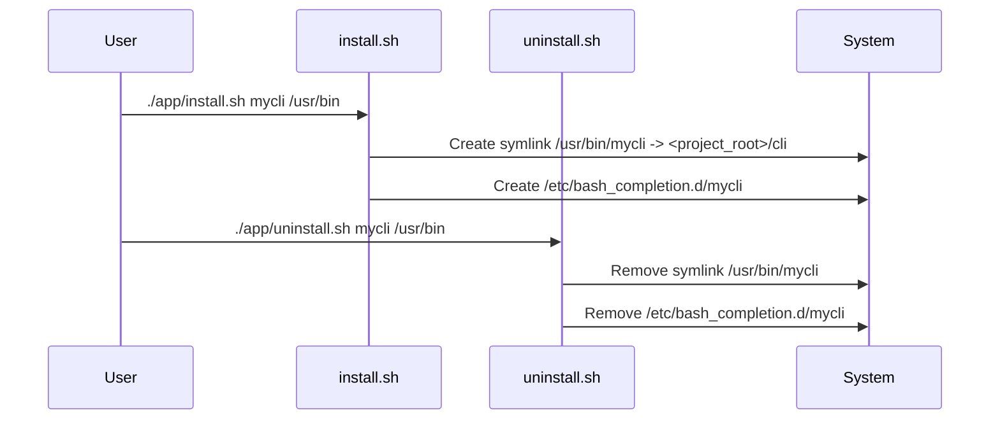

# CLI Installation & Uninstallation

This chapter explains how to make your bash CLI accessible globally on your system and how to remove it when you're done.  Imagine you've created a helpful CLI tool and want to use it from anywhere without having to navigate to its directory. This chapter covers the installation and uninstallation process that makes this possible.

## Installing Your CLI

This procedure describes how to install your bash CLI, making it accessible system-wide.

**Prerequisites:**

* A completed bash CLI project.
* Appropriate permissions for writing to system directories (likely requiring `sudo`).

**Procedure:**

1. Navigate to the root of your Bash CLI project. This is the directory containing the `cli` file and the `app` directory.
2. Run the `install.sh` script, providing the desired name for your CLI and optionally the installation folder (defaults to `/usr/bin`).

   ```bash
   ./app/install.sh <cli_name> [<install_folder>] 
   ```
   For example:
   ```bash
   sudo ./app/install.sh mycli 
   ```
   This installs the CLI as `mycli` in `/usr/bin`.


**Verification:**

* Check if `<install_folder>/<cli_name>` exists and points to the correct `cli` file within your project.
* Try running your CLI from any directory using `<cli_name>`.

**Troubleshooting:**

* **"You are not within a Bash CLI project" error:** Ensure you are running the script from the project root. See [Project Context & Validation](06_project_context___validation_.md) for more details.
* **Permission errors:**  Use `sudo` to run the install script.

## Uninstalling your CLI

This procedure describes how to remove your bash CLI from the system.

**Prerequisites:**

* Appropriate permissions for removing files from system directories (likely requiring `sudo`).

**Procedure:**

1. Navigate to the root of your Bash CLI project.
2. Run the `uninstall.sh` script with the name of the CLI and optionally the installation folder.

   ```bash
   ./app/uninstall.sh <cli_name> [<install_folder>]
   ```
   For example:
   ```bash
   sudo ./app/uninstall.sh mycli
   ```
   This uninstalls the CLI named `mycli` from `/usr/bin`.

**Verification:**

* Check if `<install_folder>/<cli_name>` no longer exists.
* Try running your CLI using `<cli_name>`. It should fail since it's uninstalled.

**Troubleshooting:**

* **"You are not within a Bash CLI project" error:** Ensure you are running the script from the project root.  See [Project Context & Validation](06_project_context___validation_.md).
* **"Command <cli_name> did not exist in <install_folder>" error:** Double-check the CLI name and installation folder.
* **"Command <cli_name> doesn't resolve to this project" error:**  Ensure the existing symlink points to the `cli` file within your current project.


## Internal Implementation

The `install.sh` script creates a symbolic link from your project's `cli` entrypoint to the specified installation folder (e.g., `/usr/bin`).  It also sets up bash completion by creating a file in `/etc/bash_completion.d/` that sources the project's `complete` script (see [Bash Completion Logic](04_bash_completion_logic_.md)).

The `uninstall.sh` script performs the reverse operation by removing the symlink and the bash completion file.  Both scripts include checks to ensure they are operating within a valid Bash CLI project (see [Project Context & Validation](06_project_context___validation_.md)) and that the symlink points to the correct project directory.



## Conclusion

This chapter covered the installation and uninstallation process for your bash CLI. By installing your CLI, you can use it conveniently from anywhere on your system. Now, learn about project context and validation in [Project Context & Validation](06_project_context___validation_.md).


---

Generated by [AI Codebase Knowledge Builder](https://github.com/The-Pocket/Doc-Codebase-Knowledge)