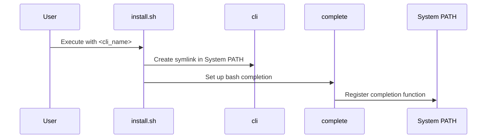

# CLI Installation & Uninstallation

You've built a fantastic Bash CLI, but it's currently confined to your project directory.  This chapter will guide you through making your CLI globally accessible from anywhere in your system, and how to remove it when needed. We'll use the `install.sh` and `uninstall.sh` scripts to achieve this.

## Installing your CLI

### Concept: Making your CLI globally accessible

This section explains how to make your CLI executable from any location in your terminal. This involves creating a symbolic link (symlink) from your CLI's entrypoint script to a directory within your system's `PATH`. We'll also set up bash completion.

### Procedure: Installing the CLI

#### Prerequisites

- A completed Bash CLI project.
- Appropriate permissions for creating symlinks and writing to system directories (likely requiring `sudo`).

#### Procedure Steps

1. Navigate to your project's root directory in your terminal.
2. Run the install script, providing the desired name for your CLI and optionally the installation directory (defaults to `/usr/bin`):

```bash
sudo ./app/install.sh <cli_name> [<install_directory>]
```

For example:

```bash
sudo ./app/install.sh mycli /usr/local/bin
```

#### Verification

Check that the symlink has been created:

```bash
ls -l <install_directory>/<cli_name>
```

The output should show a symlink pointing to your `cli` file within your project.  Also verify bash completion by typing your CLI name followed by Tab.

#### Troubleshooting

- **Permission denied:** Ensure you're using `sudo` or have the necessary permissions to write to the target directory.
- **Symlink already exists:**  If a command with the same name already exists, choose a different name for your CLI or uninstall the conflicting command first.

### Internal Implementation

The `install.sh` script performs the following actions:

1. **Project Validation:** Verifies it's running within a Bash CLI project using the presence of the `.bash_cli` marker file (See [Project Context & Validation](06_project_context___validation_.md)).
2. **Symlink Creation:** Creates a symlink from the `cli` entrypoint script to the specified installation directory (e.g., `/usr/bin`).
3. **Bash Completion Setup:** Creates a bash completion script in `/etc/bash_completion.d/` which sources the `complete` script (See [Bash Completion Logic](04_bash_completion_logic_.md)) within your project.



## Uninstalling your CLI

### Concept: Removing your CLI

This involves removing the symlink created during installation and the bash completion script.

### Procedure: Uninstalling the CLI

#### Prerequisites

- Appropriate permissions for removing files from system directories (likely requiring `sudo`).

#### Procedure Steps

1. Navigate to your project's root directory in your terminal.
2. Run the uninstall script, providing the name of your CLI and optionally the installation directory:

```bash
sudo ./app/uninstall.sh <cli_name> [<install_directory>]
```

For example:

```bash
sudo ./app/uninstall.sh mycli /usr/local/bin
```


#### Verification

Check that the symlink and the bash completion script have been removed:

```bash
ls <install_directory>/<cli_name>  # Should return an error
ls /etc/bash_completion.d/<cli_name> # Should return an error
```

#### Troubleshooting

- **Permission denied:** Use `sudo`.
- **File not found:** Verify the CLI name and installation directory are correct.

### Internal Implementation

The `uninstall.sh` script:

1. **Project Validation:** Checks if within a Bash CLI project.
2. **Symlink Validation:** Checks if the symlink exists and points to the correct `cli` file within the project.
3. **Symlink Removal:** Removes the symlink.
4. **Bash Completion Removal:** Removes the bash completion script.

## Conclusion

You now know how to install and uninstall your Bash CLI, making it readily accessible or removing it cleanly from your system.  This empowers you to distribute and manage your CLI effectively.  Next, let’s delve into [Project Context & Validation](06_project_context___validation_.md). 


---

Generated by [AI Codebase Knowledge Builder](https://github.com/The-Pocket/Doc-Codebase-Knowledge)