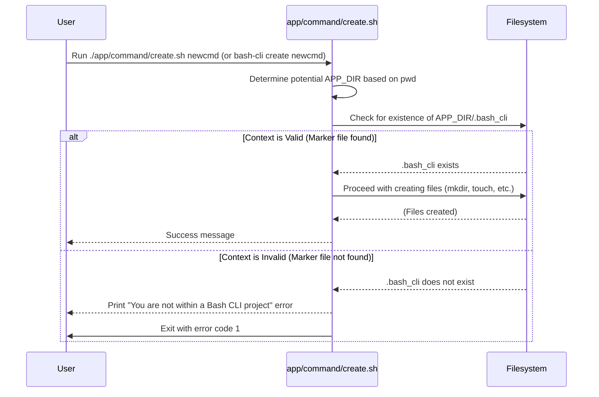

# Project Context & Validation

In the previous chapter, [CLI Installation & Uninstallation](05_cli_installation___uninstallation_.md), we discussed how to make your CLI tool accessible system-wide. This chapter explains a crucial safety mechanism: ensuring that commands which modify the project structure (`create`, `rm`) or manage its installation (`install`, `uninstall`) are only executed from within a valid `bash-cli` project directory.

This validation prevents accidental actions, such as trying to create a command structure in your home directory or removing unrelated files because a command was run from the wrong location. `bash-cli` needs to be sure it's operating on the intended project.

## Key Concepts

This validation relies on a few simple components:

1.  **The `.bash_cli` Marker File:** A hidden, empty file located at `app/.bash_cli` within your project. Its sole purpose is to act as a unique identifier, confirming that the directory structure belongs to a `bash-cli` project.
2.  **`APP_DIR` Variable:** Internal scripts like `create`, `rm`, `install`, and `uninstall` need to know the path to the project's `app/` directory. They determine this path based on the current working directory (`pwd`) and the location of the `.bash_cli` marker file.
3.  **Context-Aware Commands:** Commands like `create`, `rm`, `install`, and `uninstall` include logic at the beginning of their scripts to perform this context check.
4.  **Validation Logic:** The script checks for the existence of `app/.bash_cli` relative to the presumed project root. If the marker file isn't found, the script prints an error message and exits immediately, preventing any further action.

## How It Works

From a user's perspective, this validation is mostly transparent when working correctly. You navigate to your project directory and run commands like `bash-cli create new-command`. The validation happens automatically.

However, if you try to run a context-aware command from *outside* a `bash-cli` project:

**Use Case:** Attempting to create a command from the home directory.

**Input:**

```bash
cd ~
bash-cli create my-command # Assuming bash-cli is installed globally
```

**Result:**

The `create` script executes its validation logic. It looks for an `app/.bash_cli` file relative to the current directory (`~`). Since it won't find one, it fails:

```
You are not within a Bash CLI project
Please change your directory to a valid project or run the init command to set one up.
```

The script exits with an error code, and no files or directories are created. This prevents accidental modification of unintended locations.

## Internal Implementation

The validation logic is typically one of the first things executed within the scripts that require it. It confirms the execution context before performing any potentially destructive or structure-altering operations.



### Code Snippets for Validation

This standard block of code appears near the beginning of scripts like `app/command/create.sh`, `app/command/rm.sh`, `app/install.sh`, and `app/uninstall.sh`.

**1. Determining `APP_DIR`:**

The script first determines the likely path to the `app/` directory. It handles cases where the script might be run from the project root or directly from the `app/` directory itself.

```bash
# --- From: app/command/create.sh ---
APP_DIR=$(pwd) # Get current working directory

# If inside 'app/' and '.bash_cli' exists there, adjust APP_DIR
if [[ -d "$APP_DIR/app" && -f "$APP_DIR/app/.bash_cli" ]]; then
    # This case handles running 'bash-cli create ...' from project root
    APP_DIR="$APP_DIR/app"
# The 'install.sh' / 'uninstall.sh' scripts have slightly different logic
# as they are expected to run from the project root. Example:
# if [[ -f "$APP_DIR/.bash_cli" ]]; then # Check inside current dir
#     APP_DIR=$(dirname "$APP_DIR") # Go up one level if marker is in pwd
# fi
fi
# At this point, APP_DIR should point to the intended 'app' directory
```

This logic tries to standardize `APP_DIR` to point correctly to the `app/` directory containing the `.bash_cli` marker, regardless of whether the user is in the project root (`my-project/`) or potentially inside the `app/` directory (`my-project/app/`).

**2. Checking for the Marker File:**

Once the potential `APP_DIR` is set, the script checks for the `.bash_cli` file within that directory.

```bash
# --- From: app/command/create.sh ---

# Validate the determined APP_DIR
if [[ ! -f "$APP_DIR/.bash_cli" ]]; then
    # Print error message to standard error
    >&2 echo -e "\033[31mYou are not within a Bash CLI project\033[39m"
    >&2 echo "Please change your directory to a valid project or run the init command to set one up."
    # Exit with a non-zero status code to indicate failure
    exit 1
fi

# --- Script continues only if the marker file was found ---
```

This is the core validation step. If the `app/.bash_cli` file does not exist at the calculated path, it prints the standard error message and halts execution using `exit 1`.

## Conclusion

Project context validation is a simple yet vital safety feature in `bash-cli`. By checking for the presence of the `app/.bash_cli` marker file, commands like `create`, `rm`, `install`, and `uninstall` ensure they operate only within the intended project directory. This prevents errors and unintended modifications, making the framework safer and more reliable to use. The automatic determination of `APP_DIR` and the standardized error message provide a consistent experience.

Next, we will explore the common helper functions available for use within your command scripts in the [Core Function Library](07_core_function_library_.md) chapter.

---

Generated by [AI Codebase Knowledge Builder](https://github.com/The-Pocket/Doc-Codebase-Knowledge)