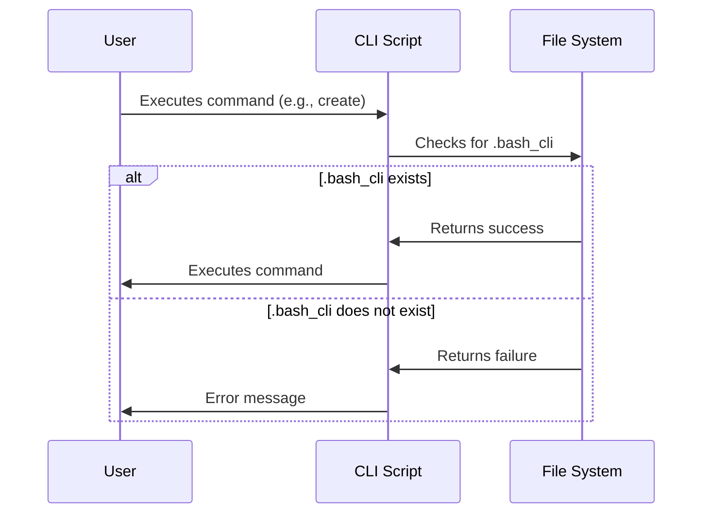

# Project Context & Validation

This chapter explains how the `bash-cli` project ensures commands operate within the correct project directory. Imagine you are building a command-line tool using `bash-cli`.  You want to make sure commands like `create` and `rm` only modify the files within your project, preventing accidental changes elsewhere on your system. Project context validation solves this problem.

## Key Concept: The `.bash_cli` Marker File

`bash-cli` uses a special file named `.bash_cli` located in the `app/` directory of your project as a marker.  This file signifies the root of your `bash-cli` project.  When you run a command, `bash-cli` checks for this file to confirm you are in the correct location.

## Usage Example

Let's say your project is structured like this:

```
my-project/
├── app/
│   └── .bash_cli
└── cli
```

If you run a command like `create` from within the `my-project/` directory, the script first checks for `.bash_cli` within `my-project/app/`. Finding it, the `APP_DIR` variable is set to `my-project/app/`, ensuring subsequent actions occur within the project directory.

If you were to run the same command from outside `my-project/`, the validation would fail, preventing unintended modifications outside your project.

## Implementation Details

The project context validation logic is implemented directly within each command script. Let's examine a simplified version of the check from the `create.sh` script:

```bash
APP_DIR=$(pwd)
if [[ -d "$APP_DIR/app" && -f "$APP_DIR/app/.bash_cli" ]]; then
    APP_DIR="$APP_DIR/app"
fi

if [[ ! -f "$APP_DIR/.bash_cli" ]]; then # Check for marker file
    >&2 echo -e "\033[31mYou are not within a Bash CLI project\033[39m"
    exit 1
fi
# ... rest of the create command logic ...
```

This snippet first gets the current working directory. It then checks if the marker file exists in `app/` subdirectory. If it exists, `APP_DIR` is updated. Finally, it checks if the marker file exists in the determined `APP_DIR`.  If not found, it prints an error and exits.  Similar logic is present in other command scripts like `rm.sh`, `install.sh`, and `uninstall.sh` (see code examples in the beginning of this chapter).


## Sequence Diagram




## Code Examples

This validation logic can be found in several files, including:

- `app/command/create.sh`
- `app/command/rm.sh`
- `app/install.sh`
- `app/uninstall.sh`

The code snippets provided at the beginning of this chapter show the implementation details within these files.


## Conclusion

Project context validation is a crucial mechanism in `bash-cli` that ensures commands operate safely within the defined project boundaries.  This prevents accidental modifications outside your project and helps maintain a consistent project structure.

[Next Chapter: Core Function Library](07_core_function_library_.md)


---

Generated by [AI Codebase Knowledge Builder](https://github.com/The-Pocket/Doc-Codebase-Knowledge)