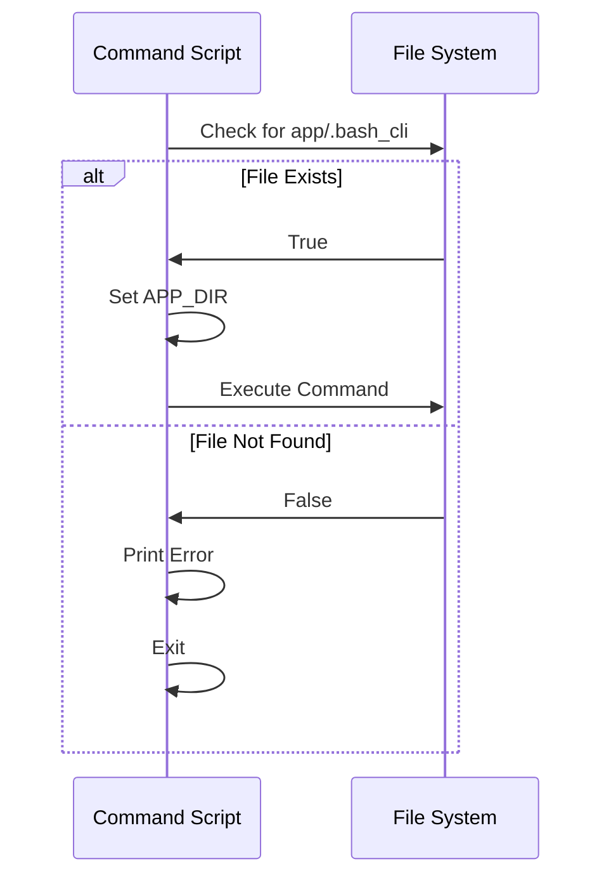

# Project Context & Validation

This chapter explains how `bash-cli` ensures commands operate within the correct project directory.  Imagine you're trying to create a new command within your CLI, but you're not in the right folder.  `bash-cli` uses project context validation to prevent this and other similar issues, guiding you to the right location.

## Concept: Project Context

A `bash-cli` project is identified by the presence of a marker file named `.bash_cli` within the `app/` directory. This marker file signifies that the directory and its subdirectories contain the structure and files related to your command-line interface project.

## Procedure: Validating Project Context

This procedure outlines how `bash-cli` validates the project context.

**Prerequisites:** A `bash-cli` project initialized using the `init` command (not covered in this chapter).

**Procedure Steps:**

1. **Determine Potential App Directory:** Scripts first check if a `.bash_cli` file exists in the current directory. If so, the project root is one level above.
2. **Check for Marker File:** Check if `app/.bash_cli` exists relative to the determined project root directory.
3. **Set APP_DIR:** If the `.bash_cli` file is found, the `APP_DIR` variable is set to the absolute path of the `app/` directory.
4. **Handle Invalid Context:** If the `.bash_cli` file isn't found, an error message is printed to `stderr`, and the script exits.

**Verification:** Observe the error message if you execute a command like `create`, `rm`, `install`, or `uninstall` outside a valid `bash-cli` project directory.

**Troubleshooting:** If validation fails, navigate to the root of your `bash-cli` project where the `app/` directory resides.

**Example:**

```bash
# Snippet from app/command/create.sh
APP_DIR=$(pwd)
if [[ -d "$APP_DIR/app" && -f "$APP_DIR/app/.bash_cli" ]]; then
    APP_DIR="$APP_DIR/app"
fi

if [[ ! -f "$APP_DIR/.bash_cli" ]]; then  # Check for the marker file
    >&2 echo -e "\033[31mYou are not within a Bash CLI project\033[39m"
    exit 1 # Exit if not in a valid project
fi
```
This code snippet first checks if the current directory (`pwd`) potentially contains the project's app directory (`app/`) and the marker file.  If so, it adjusts `APP_DIR` accordingly. It then verifies the marker file's existence at `$APP_DIR/.bash_cli`.  If not found, it prints an error message and exits with a non-zero exit code indicating an error.

## Internal Implementation

The project context validation logic is embedded within each command script (`create.sh`, `rm.sh`, `install.sh`, `uninstall.sh`). This decentralized approach ensures that every command respects the project context before proceeding.  Here's a simplified sequence diagram:



## Reference: Relevant Files

* `app/command/create.sh`
* `app/command/rm.sh`
* `app/install.sh`
* `app/uninstall.sh`

These files contain nearly identical project context validation logic at the beginning of their scripts, demonstrating the consistent implementation across different commands.


## Conclusion

Project context validation ensures commands operate within the intended project environment, preventing accidental modifications outside the `bash-cli` project.  This contributes to a more robust and predictable CLI development experience.

[Next Chapter: Core Function Library](07_core_function_library_.md)


---

Generated by [AI Codebase Knowledge Builder](https://github.com/The-Pocket/Doc-Codebase-Knowledge)