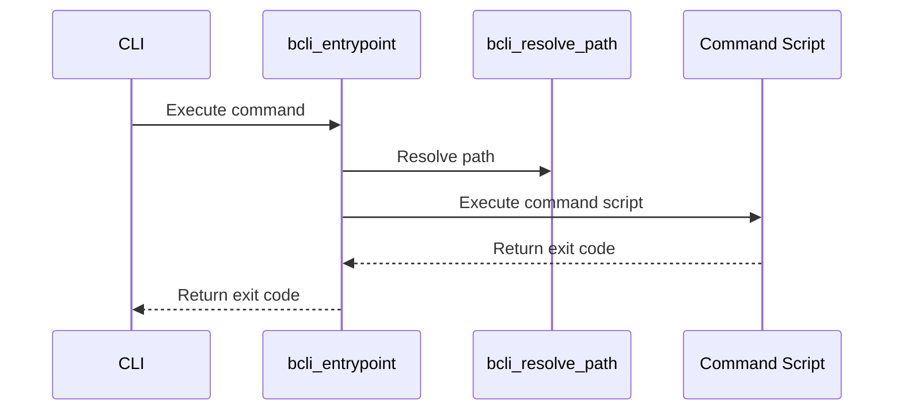

# Core Function Library

This chapter explains the core function library of `bash-cli`, which provides reusable functions for common tasks, promoting consistency and reducing code duplication.  Imagine you are building a CLI and need consistent output formatting and a robust way to handle command dispatching. The core function library addresses these needs.

## Introduction

The core function library of the `bash-cli` framework resides in the `bash-cli.inc.sh` file. This file contains a collection of Bash functions that are used throughout the framework for various purposes, including:

* **Path Resolution:**  Handles absolute path resolution.
* **String Manipulation:** Provides utilities for tasks like trimming whitespace.
* **Output Formatting:** Defines color constants and functions for displaying formatted output.
* **Core CLI Logic:** Implements the command dispatching mechanism, help generation, and Bash completions.

## Using the Core Functions

This section demonstrates how to use some of the key functions provided by the library.

### Path Resolution

The `bcli_resolve_path` function resolves a given path to its absolute form.

```bash
source bash-cli.inc.sh

path=$(bcli_resolve_path "./relative/path")
echo "$path" # Output: /absolute/path/to/relative/path (example)
```

This function ensures that you are working with absolute paths, regardless of the user's current working directory. It uses `realpath` if available, and falls back to a Perl solution for compatibility with systems like macOS.

### String Manipulation

The `bcli_trim_whitespace` function removes leading and trailing whitespace from a string.

```bash
source bash-cli.inc.sh

string="  string with whitespace  "
trimmed_string=$(bcli_trim_whitespace "$string")
echo "$trimmed_string" # Output: string with whitespace
```
This is useful for cleaning user input or formatting output.


### Output Formatting

The library defines color constants and provides functions for styled output.

```bash
source bash-cli.inc.sh

echo -e "${COLOR_RED}This is red text${COLOR_NORMAL}" # Output: This is red text (in red color)
```

The `bcli_show_header` function displays a formatted header for your CLI application.

```bash
source bash-cli.inc.sh

bcli_show_header "<project_root>/app" # Output: CLI Name, Version, and Author from .name, .version, and .author files.
```

This function reads the `.name`, `.version`, and `.author` files from your application directory and displays them in a formatted header.


## Internal Implementation

The `bash-cli.inc.sh` file is sourced by both the main `cli` script and the `complete` script. This allows both scripts to access and utilize the shared functions. The `cli` script uses the `bcli_entrypoint` function for command dispatching, while the `complete` script uses `bcli_bash_completions` for Bash completions.


The following sequence diagram illustrates the interaction between the `cli` script and the core functions for command dispatching:



### Command Dispatching (`bcli_entrypoint`)

The `bcli_entrypoint` function in `bash-cli.inc.sh` (explained in [Command Dispatcher](02_command_dispatcher_.md)) handles the logic for locating and executing the appropriate command script based on user input. It uses `bcli_resolve_path` to resolve paths, and if the command requires help, it leverages the `bcli_help` function (explained in [Help Generation
](03_help_generation_.md)).


### Bash Completions (`bcli_bash_completions`)

The `bcli_bash_completions` function in `bash-cli.inc.sh` (explained in [Bash Completion Logic
](04_bash_completion_logic_.md)) provides Bash completion functionality for your CLI.  It dynamically generates completion suggestions based on available commands and options.


## Conclusion

The core function library is essential to the `bash-cli` framework, providing reusable functionality for common tasks and ensuring consistency across your CLI application.  By leveraging these functions, you can simplify your CLI development process and create a more robust and user-friendly command-line interface.


[CLI Installation & Uninstallation
](05_cli_installation___uninstallation_.md)


---

Generated by [AI Codebase Knowledge Builder](https://github.com/The-Pocket/Doc-Codebase-Knowledge)