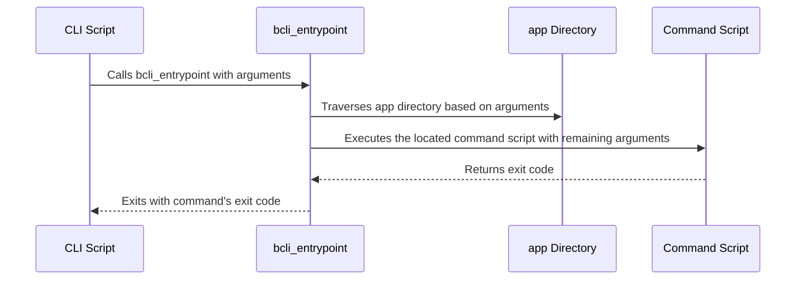

# Core Function Library

This chapter explains the core function library, a set of shared Bash functions that power the `bash-cli` framework. Imagine you're building a CLI and need consistent output formatting, path manipulation, or a streamlined way to handle command dispatching. The core function library solves this by providing reusable functions in a central include file, `bash-cli.inc.sh`, ensuring consistency and reducing code duplication.

## Concept: Centralized Utility Functions

This concept section describes the "what" and "why" of the core function library. The `bash-cli` framework provides a set of reusable utility functions in a central location, `bash-cli.inc.sh`, to promote code reuse and consistency across different parts of your CLI application. This avoids redundant code and ensures standardized behavior for common tasks like path resolution, string manipulation, and output formatting.

## Reference: Key Functions in `bash-cli.inc.sh`

This reference section provides a brief overview of the crucial functions available in `bash-cli.inc.sh`.

| Function Name        | Description                                                                       |
|----------------------|-----------------------------------------------------------------------------------|
| `bcli_resolve_path` | Resolves a given path to its absolute, canonical form.                          |
| `bcli_trim_whitespace` | Trims leading and trailing whitespace from a string.                             |
| `bcli_show_header`    | Displays the CLI header information (name, version, author).                      |
| `bcli_entrypoint`   | The main entry point for the CLI; handles command dispatch, help, and completion. |
| `bcli_help`           | Displays help information for commands and subcommands.                           |
| `bcli_bash_completions` | Provides Bash completions for the CLI.                                          |


## Procedure: Using the Core Functions

This procedure section guides you through using the core functions.

**Prerequisites:**  The `bash-cli.inc.sh` file must be sourced in your script.

**Procedure:**

1. **Include the library:** In your main CLI script (`cli`) and completion script (`complete`), source the `bash-cli.inc.sh` file. See the provided code snippets for how this is done in both files. This makes the core functions available in your scripts.

2. **Call the functions:** You can now call any of the core functions directly within your CLI scripts.  For example, to resolve a path:

   ```bash
   resolved_path=$(bcli_resolve_path "<path_to_resolve>")
   echo "$resolved_path" 
   ```

   Input: `<path_to_resolve>` (e.g., `../my_dir`).
   Output: The absolute path (e.g., `/home/user/my_dir`).

3. **Colorized output:** Use the provided color constants (e.g., `COLOR_RED`, `COLOR_GREEN`)  alongside `echo -e` for formatted output:

   ```bash
   echo -e "${COLOR_RED}This is an error message.${COLOR_NORMAL}"
   ```

   Output:  "This is an error message." in red.

**Verification:** Test your CLI to verify that the functions are working as expected.

**Troubleshooting:** If a function isn't working, check that you've sourced `bash-cli.inc.sh` correctly and that the input arguments are valid.

## Internal Implementation: Command Dispatching

This section details the `bcli_entrypoint` function, which is the heart of the command dispatch mechanism.  It uses the command line arguments to determine which command to execute.



The `bcli_entrypoint` function (in `bash-cli.inc.sh`) does the following:

1. Determines the root directory of the CLI.
2. Traverses the `app` directory based on the provided command line arguments.
3. Locates and executes the corresponding command script.
4. Handles `--help` arguments by calling [Help Generation](03_help_generation.md).
5. Exits with the same code as the executed command.

```bash
# ... (Other code from bash-cli.inc.sh)

function bcli_entrypoint() {
    # ... (Implementation details - directory traversal, command execution, etc.)
}
```

## Conclusion

This chapter explained the `bash-cli` core function library, which promotes code reuse and consistency.  You learned about key functions for path resolution, string manipulation, and output formatting.  You also saw how the `bcli_entrypoint` function manages command dispatching. [Next Chapter: CLI Installation & Uninstallation
](05_cli_installation___uninstallation_.md)


---

Generated by [AI Codebase Knowledge Builder](https://github.com/The-Pocket/Doc-Codebase-Knowledge)