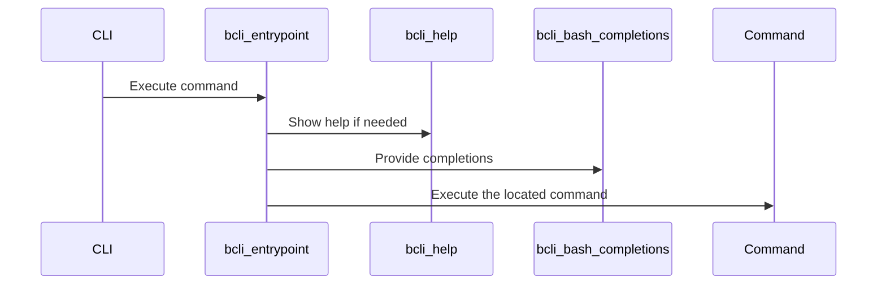

# Core Function Library

This chapter explores the core function library, a central include file (`bash-cli.inc.sh`) that houses shared Bash functions, promoting code reuse and consistency throughout the framework. Imagine you are building a CLI and want to add common functionalities like path resolution, string manipulation, and formatted output without rewriting the code for each command. The core function library provides these ready-to-use utilities.

## Concept: Understanding the Core Function Library

**What:** The Core Function Library is a set of reusable Bash functions located in `bash-cli.inc.sh`.  **Why:**  It provides consistent implementations of common tasks, reducing code duplication and improving maintainability across your CLI commands. It handles tasks like path resolution, string manipulation, output formatting, and the core logic for command dispatch, help generation, and completion.

### Key Concepts

* **Centralized Functions:**  All core functions reside in `bash-cli.inc.sh`, making them easily accessible and modifiable.
* **Standardized Implementation:** The library ensures consistent behavior for common tasks, preventing inconsistencies across different commands.
* **Code Reusability:**  Instead of rewriting common functionalities, you can simply call the pre-built functions, saving development time and effort.


## Procedure: Using the Core Function Library

**What:** This section describes how to use the functions within the Core Function Library.  **Why:** By understanding how to call these functions, you can leverage the library's capabilities in your own CLI commands.

### Prerequisites

* A Bash environment.
* The `bash-cli.inc.sh` file in your project.

### Procedure

1. **Include the library:**  Source the `bash-cli.inc.sh` file in your script.

   ```bash
   . "<path_to_bash-cli.inc.sh>"
   ```
   This makes all functions within the included file available in your current script.  Replace `<path_to_bash-cli.inc.sh>` with the actual path.

2. **Call a function:** Use the function name followed by arguments. For example, to resolve a path:

   ```bash
   resolved_path=$(bcli_resolve_path "<path_to_resolve>")
   echo "$resolved_path"
   ```
   This calls the `bcli_resolve_path` function with the given path and stores the result in the `resolved_path` variable. The output will be the absolute resolved path.

3.  **Use color constants:** To format output with color, use the provided constants:

    ```bash
    echo -e "${COLOR_RED}This is red text${COLOR_NORMAL}"
    ```
    This will print the text "This is red text" in red. The `COLOR_NORMAL` constant resets the color to the default.

### Verification

* Check that the functions produce the expected output. For `bcli_resolve_path`, verify the path is correctly resolved. For string manipulation and output formatting, visually inspect the results.

### Troubleshooting

* **Function not found:** Ensure that `bash-cli.inc.sh` is sourced correctly with the correct path.
* **Unexpected output:** Double-check the function arguments and review the function's implementation in `bash-cli.inc.sh` for potential issues.


## Reference: Internal Implementation

This section dives into the internal implementation of the Core Function Library.

The `bash-cli.inc.sh` file contains the implementation of the core functions. These functions leverage standard Bash commands and utilities.  For instance, `bcli_resolve_path` uses `realpath` (if available) or a Perl fallback for path resolution.  `bcli_trim_whitespace` leverages parameter expansion for string manipulation.  [Command Dispatcher](02_command_dispatcher_.md), [Help Generation](03_help_generation_.md), and [Bash Completion Logic](04_bash_completion_logic_.md) are implemented using functions like `bcli_entrypoint`, `bcli_help`, and `bcli_bash_completions`, respectively.



Example: The `bcli_resolve_path` function:

```bash
# ... other functions ...

function bcli_resolve_path() {
    # ... implementation details (see bash-cli.inc.sh) ...
}

# ... more functions ...
```

This function resolves paths using `realpath` or a Perl fallback, as explained earlier.  Refer to the `bash-cli.inc.sh` file for the complete implementation of each function.

## Conclusion

The Core Function Library is a vital component of the `bash-cli` framework, ensuring consistency and reducing redundancy. By understanding its usage and internal workings, you can effectively utilize its functions to build powerful and maintainable CLIs.  Next, let us delve into [CLI Installation & Uninstallation](05_cli_installation___uninstallation_.md).


---

Generated by [AI Codebase Knowledge Builder](https://github.com/The-Pocket/Doc-Codebase-Knowledge)