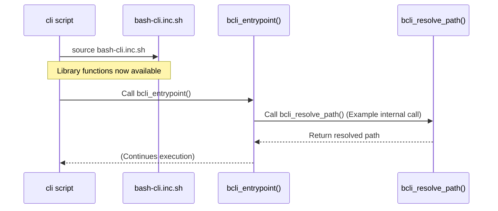

# Core Function Library


In the previous chapter, [Project Context & Validation](06_project_context___validation_.md), we explored how `bash-cli` ensures certain commands run only within a valid project directory. This chapter introduces the central collection of shared Bash functions that underpin much of the framework's functionality: the Core Function Library.

This library is a single file, `bash-cli.inc.sh`, containing common utilities and the core logic for features discussed in earlier chapters. It promotes code reuse, ensures consistency across different parts of the framework, and simplifies maintenance. Imagine needing to reliably find the absolute path of a file or trim whitespace from user input – these common tasks are solved once in the library and reused everywhere.

## Key Concepts

1.  **Central Include File (`bash-cli.inc.sh`):** This file resides in your project's root directory and contains all the shared Bash functions and constants provided by `bash-cli`.
2.  **Implicit Sourcing:** Key internal scripts like the main `cli` entrypoint, the `help` script, and the `complete` script automatically "source" (include) `bash-cli.inc.sh`. This makes the library functions available within their execution context without needing explicit inclusion in those specific files.
3.  **Function Categories:** The library provides functions for various purposes:
    *   **Utilities:** Helpers like `bcli_resolve_path` (finding the absolute path, handling symlinks) and `bcli_trim_whitespace` (removing leading/trailing spaces).
    *   **Output Formatting:** Predefined color constants (e.g., `COLOR_RED`, `COLOR_GREEN`, `COLOR_NORMAL`) and functions like `bcli_show_header` (displaying the CLI name, version, author).
    *   **Core Framework Logic:** The main functions driving key features reside here, including `bcli_entrypoint` for the [Command Dispatcher](02_command_dispatcher_.md), `bcli_help` for [Help Generation](03_help_generation_.md), and `bcli_bash_completions` for [Bash Completion Logic](04_bash_completion_logic_.md).
4.  **Consistency & Maintainability:** By centralizing these functions, `bash-cli` ensures that path resolution, output formatting, and core behaviors are handled identically across the framework. Updates or bug fixes to these functions only need to be made in one place.

## Using the Library Functions

While primarily used internally by the `bash-cli` framework scripts, you *can* leverage these utility functions within your custom command scripts (`app/...`) if needed. To do so, you must explicitly source the `bash-cli.inc.sh` file within your command script.

**Use Case:** Create a command that prints a message in green using a library constant and trims input using a library function.

**Input:** Create a command script `app/greet` with the following content:

```bash
#!/usr/bin/env bash

# Determine the project root directory relative to this script
# (Simplified - real scripts might use more robust methods)
SCRIPT_DIR=$(dirname "$(readlink -f "$0")")
ROOT_DIR=$(dirname "$SCRIPT_DIR") # Assumes app/greet structure

# Source the core library to access its functions and variables
# shellcheck source=../../bash-cli.inc.sh
source "$ROOT_DIR/bash-cli.inc.sh"

# Use a color constant from the library
echo -e "${COLOR_GREEN}Hello!${COLOR_NORMAL}"

# Use a utility function from the library
user_input="   Some padded text   "
trimmed_input=$(bcli_trim_whitespace "$user_input")
echo "Trimmed input: '$trimmed_input'"
```

**Result:** When you run `mycli greet`, it will:

1.  Source `bash-cli.inc.sh`.
2.  Print "Hello!" in green text.
3.  Print "Trimmed input: 'Some padded text'".

*Note:* Explicitly sourcing `bash-cli.inc.sh` in your commands creates a dependency on the framework's internal structure. Use this primarily for accessing stable utility functions like color constants or string manipulation when needed.

## Internal Implementation

The core framework scripts rely heavily on sourcing `bash-cli.inc.sh` to gain access to the necessary functions.



### Sourcing the Library

The main `cli` script sources the library early in its execution:

```bash
# --- From: cli ---
#!/usr/bin/env bash

# Helper function to resolve path (might be simplified here)
realpath() {
    # ... logic to find absolute path ...
    perl -e 'use Cwd "abs_path"; print abs_path(shift)' "$1"
}

# Determine the directory containing this script
ROOT_DIR=$(dirname "$(realpath "$0")")

# Source the core library file
# shellcheck source=./bash-cli.inc.sh
. "$ROOT_DIR/bash-cli.inc.sh"

# Call the main entrypoint function from the library
bcli_entrypoint "$@"
```

Similarly, the `complete` script sources the library to access `bcli_bash_completions`:

```bash
# --- From: complete ---
#!/usr/bin/env bash

# ... (helper function bcli_realpath) ...

# Function registered with Bash completion
function _bash_cli() {
    local root_dir;
    root_dir=$(dirname "$(bcli_realpath "$(which "${COMP_WORDS[0]}")")")

    # Source the core library file
    # shellcheck source=./bash-cli.inc.sh
    . "$root_dir/bash-cli.inc.sh"

    # Call the completion logic function from the library
    bcli_bash_completions
}
```

### Example Library Functions

Here are simplified examples of functions found within `bash-cli.inc.sh`:

**Path Resolution:**

```bash
# --- From: bash-cli.inc.sh ---

# Resolves a path to its absolute form, handling symlinks.
# Uses 'realpath' utility if available, otherwise falls back to perl.
function bcli_resolve_path() {
    if [ -x "$( which realpath )" ]; then
        "$( which realpath )" "$1"
    else
        # Fallback for systems without 'realpath' (e.g., older macOS)
        perl -e 'use Cwd "abs_path"; print abs_path(shift)' "$1"
    fi
}
```

**String Trimming:**

```bash
# --- From: bash-cli.inc.sh ---

# Removes leading and trailing whitespace from a string.
function bcli_trim_whitespace() {
    local var="$*"
    # Remove leading whitespace
    var="${var#"${var%%[![:space:]]*}"}"
    # Remove trailing whitespace
    var="${var%"${var##*[![:space:]]}"}"
    echo -n "$var"
}
```

**Output Formatting (Header):**

```bash
# --- From: bash-cli.inc.sh ---

# Displays the standard header using .name, .version, .author files.
# Assumes color constants (e.g., COLOR_CYAN) are defined elsewhere in the file.
function bcli_show_header() {
    # $1 should be the path to the 'app' directory
    echo -e "$(bcli_trim_whitespace "$(cat "$1/.name")")"
    echo -e "${COLOR_CYAN}Version  ${COLOR_NORMAL}$(bcli_trim_whitespace "$(cat "$1/.version")")"
    echo -e "${COLOR_CYAN}Author   ${COLOR_NORMAL}$(bcli_trim_whitespace "$(cat "$1/.author")")"
}
```

**Color Constants:**

```bash
# --- From: bash-cli.inc.sh ---

# ANSI escape codes for terminal colors.
# shellcheck disable=SC2034 # Defined for use by other functions/scripts
COLOR_RED="\033[31m"
COLOR_GREEN="\033[32m"
COLOR_CYAN="\033[36m"
COLOR_NORMAL="\033[39m"
# ... (other colors omitted for brevity)
```

The core logic functions (`bcli_entrypoint`, `bcli_help`, `bcli_bash_completions`) also reside in this file but are detailed in their respective chapters: [Command Dispatcher](02_command_dispatcher_.md), [Help Generation](03_help_generation_.md), and [Bash Completion Logic](04_bash_completion_logic_.md).

## Conclusion

The Core Function Library (`bash-cli.inc.sh`) is the heart of the `bash-cli` framework, providing a centralized repository for shared utilities, output formatting tools, and the fundamental logic driving command dispatch, help generation, and bash completion. By sourcing this library, the framework's internal scripts maintain consistency and benefit from shared code. While accessible to custom command scripts, its primary role is to serve as the common foundation upon which the rest of the framework is built.

This concludes the overview of the core concepts behind the `bash-cli` framework. With an understanding of the command structure, dispatcher, help system, completion, installation, validation, and the core library, you have the foundational knowledge to build and manage your own command-line applications using `bash-cli`.

---

Generated by [AI Codebase Knowledge Builder](https://github.com/The-Pocket/Doc-Codebase-Knowledge)