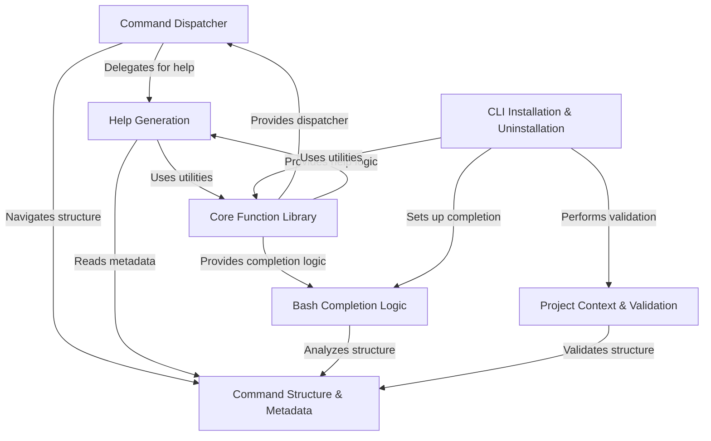

# Doc: bash-cli

This project provides a **framework** for creating Bash command-line interfaces (CLIs).
It leverages a *convention-based directory structure* (`app/`) where executable files represent commands and subcommands.
Core functionalities include **command dispatching** based on arguments, automatic **help generation** derived from `.help`/`.usage` metadata files alongside commands, integrated **bash completion**, and scripts for CLI **installation/uninstallation**.

**Source Repository:** [https://github.com/SierraSoftworks/bash-cli](https://github.com/SierraSoftworks/bash-cli)

## Chapters

1. [Command Structure & Metadata
](01_command_structure___metadata_.md)
2. [Command Dispatcher
](02_command_dispatcher_.md)
3. [Help Generation
](03_help_generation_.md)
4. [Bash Completion Logic
](04_bash_completion_logic_.md)
5. [CLI Installation & Uninstallation
](05_cli_installation___uninstallation_.md)
6. [Project Context & Validation
](06_project_context___validation_.md)
7. [Core Function Library
](07_core_function_library_.md)

---

Generated by [AI Codebase Knowledge Builder](https://github.com/The-Pocket/Doc-Codebase-Knowledge)